# 🛡️ Aaraksha — Smart Tourism, Safe Journey

<p align="center">
  <video src="./docs/aaraksha-video/Aaraksha_Full_Ecosystem_Video.mp4" controls="controls" muted="muted" style="max-width:100%; max-height:640px;"></video>
</p>

### 🧠 [**→ Explore the live Aaraksha Neural Map**](https://claude.ai/artifact/2XBsvLZRxmtQXdStDi4wJc) — the entire real codebase, rendered as an interactive 3D graph
4,162 real functions, classes, and files across the backend and all four portals, connected by
8,533 AST-extracted calls and imports, laid out live in the browser with GPU-accelerated
force physics. Not a diagram of the architecture — the architecture itself. Search any symbol,
click to trace its real call graph, orbit and zoom through the whole system in 3D.
([local copy](./docs/neural-map/index.html) also included — serve it, e.g. `npx serve docs/neural-map`,
since browsers block `fetch()` on `file://`)

---

**One journey, three intelligence layers: AI-planned, verified-tourism-enabled, and
safety-protected — an integrated platform for Northeast India built for Smart India Hackathon
2026, Student Innovation category, Travel & Tourism theme.**

> *Aaraksha* (आराक्षा) — "protection." Not a translation exercise: it's the one-word summary of
> what every screen in this system is trying to do — including, now, protecting a tourist's
> money and time from a fragmented planning experience, not just their body from an emergency.

> **Submission title:** *Aaraksha — An AI-Native Travel Planning, Verified Local Tourism
> Discovery, and Offline-Resilient Safety Platform for Northeast Indian Terrain*
>
> Deliberately three claims, not one, because that's what the system actually is: an AI travel
> assistant that plans, costs, and adapts a real itinerary; a government-verified directory of
> real local hotels, homestays, guides, and artisans surfaced inside that same itinerary — the
> direct answer to this PS's own "including hotels, travel and others"; and a safety layer that
> keeps working with zero signal, ties the tourist, their family, government dispatch, and a
> rescuer on the ground into one live picture, and never lets the first two claims come at the
> cost of the third.

[]()
[]()
[]()
[]()
[]()
[]()
[]()
[]()
[]()

---

## 🎯 The pitch, in one paragraph

Northeast India pulls a growing number of tourists into terrain most tourism and safety apps were
never built for: 3000m mountain passes, zero-connectivity valleys, districts where the nearest
hospital is a two-hour drive — and a local tourism economy (real homestays, registered guides,
handloom cooperatives) that has almost no digital presence a traveller can actually find or trust.
Existing tourism apps stop at itinerary planning and treat "local business" as an afterthought, if
they touch it at all. Existing safety apps assume a phone signal. Aaraksha connects all three: an
**AI Travel Assistant** that plans, costs, and safety-scores a real Northeast India itinerary from
curated data, not guesswork; a **government-verified Local Tourism Providers directory** — real
hotels, homestays, registered guides, and artisan cooperatives, sourced from official registries
and OpenStreetMap, reviewed by a government operator before any tourist sees them, and surfaced
directly inside the trip being planned — the concrete answer to boosting the tourism industry a PS
about "hotels, travel and others" is actually asking for; and a **safety layer built on the
opposite assumption most apps make** — that the moment someone needs help is exactly the moment
their phone stops being reliable — SOS over SMS with zero data, a Dead Man's Switch that fires
*for* you if you go silent, a citizen volunteer network with real turn-by-turn routing, and a
government command center watching the same live picture the tourist sees. One real-time data
model, not three disconnected claims stapled to one slide.

<p align="center">
  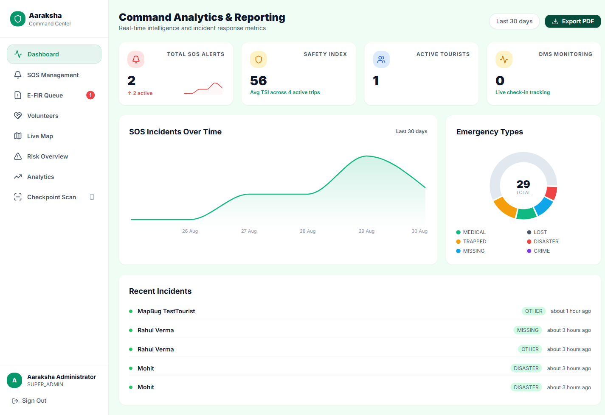
</p>

---

## 📑 Table of contents

- [🔬 Research & prior art — where Aaraksha sits](#-research--prior-art--where-aaraksha-sits)
- [🧩 Four portals, one system](#-four-portals-one-system)
- [⭐ Feature walkthrough](#-feature-walkthrough)
- [🏨 Local Tourism Providers — the tourism-industry pillar](#-local-tourism-providers--the-tourism-industry-pillar)
- [🔗 Verifiable Digital ID — the Journey Integrity Hash](#-verifiable-digital-id--the-journey-integrity-hash)
- [🤖 A real trained model — the Predictive Risk Score](#-a-real-trained-model--the-predictive-risk-score)
- [🧭 AI Travel Assistant — plan, adjust, and track a journey](#-ai-travel-assistant--plan-adjust-and-track-a-journey)
- [🚑 The unified Rescuer network](#-the-unified-rescuer-network)
- [🗺️ Routing Engine — OSRM & Contraction Hierarchies](#️-routing-engine--osrm--contraction-hierarchies)
- [🛰️ NTN — a satellite fallback transport](#️-ntn--a-satellite-fallback-transport)
- [📸 Screenshots](#-screenshots)
- [🏗️ Architecture at a glance](#️-architecture-at-a-glance)
- [📈 By the numbers](#-by-the-numbers)
- [📁 Repository layout](#-repository-layout)
- [🚀 Getting started](#-getting-started)
- [🔑 Demo accounts](#-demo-accounts)
- [🔌 API surface](#-api-surface)
- [✅ Testing](#-testing)
- [🛡️ Production readiness](#️-production-readiness)
- [⚖️ Legal & Compliance](#️-legal--compliance)
- [📚 Documentation map](#-documentation-map)
- [🛤️ Roadmap](#️-roadmap)

---

## 🔬 Research & prior art — where Aaraksha sits

Aaraksha's origin point is real and worth stating plainly: it began as an answer to **SIH25002 —
"Smart Tourist Safety Monitoring & Incident Response System using AI, Geo-Fencing, and
Blockchain-based Digital ID,"** the Ministry of Development of North Eastern Region's problem
statement from SIH 2025. This year the team is entering through the **Student Innovation
category** under the **Travel & Tourism** theme — which means proposing and scoping the problem
ourselves rather than answering a fixed departmental brief. We kept building on the same real
problem (tourist safety in a genuinely hard, genuinely underserved terrain) because a year of
iteration had already turned up gaps a fixed PS wouldn't have surfaced on its own — the Dead Man's
Switch, the unified rescuer network, the handoff verification code, the anomaly detector, the
E-FIR triage queue, and everything else below didn't come from a requirements doc, they came from
asking "what would actually leave a family reassured and a rescuer accountable" and building
until the answer held up.

**What already exists in this exact problem space**, checked directly rather than assumed:

| Project | What it is | How Aaraksha differs |
|---|---|---|
| [RakshaSetu](https://github.com/ArindamTripathi619/smart-tourist-safety-system) | An open-source SIH25002 build — full-stack tourist safety monitoring, GPS tracking, digital ID | Single-audience (tourist + a dashboard); no offline/SMS path, no Dead Man's Switch, no live-tracked rescuer network with road routing, no anti-fraud handoff verification |
| SafeVoyage (SIH25002 submission) | Shake-to-SOS, blockchain audit trail, geo-fence guidance, phone-first E-FIR filing | Closest in spirit to Aaraksha's E-FIR flow; Aaraksha deliberately doesn't ship a shake/gesture SOS trigger — unreliable with the screen off in a web PWA — and uses a confirmed voice trigger instead. No public evidence of an offline-SMS fallback, a trained risk model, or government-side rescue *dispatch* (vs. alerting) |
| Multiple other SIH25002 repos (e.g. [SharandeepSingh295](https://github.com/SharandeepSingh295/smart-tourist-safety-system), [APC2005-dev](https://github.com/APC2005-dev/Smart-Tourist-Safety-Monitoring)) | The same brief, independently built dozens of times across SIH 2025 | Confirms the recognizable shape of a "PS25002-style" submission: mobile app + geo-fence + a blockchain-flavored ID. None found ship a second, distinct audience-side app for rescuers, nor a verification step that gates case closure |
| [Meghalaya's GPS + OTP tourist-taxi app](https://www.thetraveler.org/meghalayas-tourist-taxi-app-sets-new-safety-benchmark/) *(real, in-development state government initiative, not a hackathon project)* | Verified driver/vehicle registration, SOS buttons, GPS tracking, OTP-based rides | Solves transport-leg safety specifically, for one state; not itinerary-wide, not connectivity-independent, no digital identity or rescue-coordination layer |
| [Zone8](https://play.google.com/store/apps/details?id=com.kalyanmoyborah.zone8) *(real, live app, Android + iOS)* | A published NE India travel-planning and booking app, tagline "Travel Safe" | Genuinely live and used, but is a discovery/booking product — no SOS, no DMS, no government or rescuer-facing counterpart despite the safety-adjacent tagline |

Nobody involved in this project has access to the actual winning SIH25002 submission from SIH
2025 — that information isn't public, and this README won't pretend otherwise by naming a
specific team's build. What *is* verifiable, from the search above, is the recognizable shape
every public SIH25002 implementation and every real market alternative in this space shares: a
single-audience mobile app, a safety feature that assumes signal, and no real second audience that
has to *operate* the system, not just use it. That's the bar this comparison is written against:

| The recognizable pattern this problem space keeps producing | What Aaraksha ships instead |
|---|---|
| A static "call police" button | A rule-based Travel Safety Index recalculated **hourly from live weather**, scored per destination |
| Safety features that assume signal | **Offline SOS over raw SMS** — no data connection required, a Twilio webhook does the rest |
| One app, one audience | **Four cooperating portals** — tourist, government, a no-login family tracking link, and Aaraksha Sahayak (one shared login for rescue volunteers/official teams *and* govt-verified local businesses) — sharing one real-time data model |
| A mocked/seeded demo that falls apart under a second click | A backend that went through **13 adversarial QA phases** after the first build was "done" — rate-limit bypass attempts, SQLi payloads, concurrent double-resolve races, forced transaction rollbacks, real-time session bugs — each one found, fixed, and re-verified live, not just tested once (full record: [`docs/testing/`](./docs/testing/)) |
| Safety as an isolated feature | Safety **woven into planning** — every trip gets a TSI score before it's even booked, every destination card carries a live risk badge |
| Rescue dispatch as a phone call | A **unified Rescuer network** — official teams and govt-verified citizen volunteers in one assignable pool, live GPS, real OSRM road routing, plus a **Rescue Handoff Verification Code**: a 6-digit, HMAC-hashed, 3-attempt-lockout code only the tourist holds, checked against a 250m GPS proximity gate — a rescuer has to actually be standing next to the tourist to close the case, not just claim it by radio |
| "Blockchain-based Digital ID" as a marketing phrase over a static ID card image | A real **SHA-256 hash chain** over every trip's itinerary, check-ins, SOS events, *and* government checkpoint scans — tamper-evident, independently recomputable from platform records, verifiable live with one API call |
| "AI" meaning an LLM call with a prompt attached | A **genuine trained model** for predictive risk — real gradient descent, a printed loss curve, held-out test accuracy, and per-prediction explainability — sitting *alongside* (not instead of) an honestly rule-based TSI, each clearly labeled as what it is |
| Safety that only reacts once someone presses a button | A **rule-based anomaly detector** running every minute against every active trip — flags a tourist who's gone quiet or drifted off-route *before* anyone presses SOS, no opt-in required |
| "Report a crime" ends at a crowd-sourced warning post | A real **E-FIR triage workflow** — a formal, case-numbered report routed to a role-scoped officer queue (only the roles that actually investigate can even open it) with an investigation ladder (Filed → Assigned → Under Investigation → Resolved), not a community bulletin board |
| "We tested it" meaning the happy path worked once | A dedicated security pass that found and closed a **live unauthenticated privilege-escalation path** to govt SUPER\_ADMIN, an unauthenticated SMS webhook that could forge a real emergency alert, a missing role gate on a govt endpoint, pinned every JWT verification against algorithm-confusion attacks, and fixed a rate-limiter that silently ignored its own configuration |
| Flat 2D maps vs. competitors' VR/3D showpieces, or a rescue queue sorted by raw distance alone | **Real 3D elevation terrain** on the govt map (free, keyless, no CesiumJS bloat) so a dispatcher can see the mountain ridge between a rescuer and an SOS, plus **weighted dispatch scoring** that ranks a rescuer by category fit and reputation, not distance alone |
| "Govt ID verified" meaning a regex checked the digit count | The actual **Verhoeff checksum** — the real algorithm UIDAI uses to generate an Aadhaar number's 12th digit — run client-independent, server-side, at registration |
| Privacy as a paragraph in a slide deck | Working **DPDP Act 2023 data rights** — a tourist can view exactly what's collected and why, export every record held about them as a real file download, and request deletion, which anonymizes their row in place (never a raw `DELETE`, so legally-retainable SOS/E-FIR history survives) and is refused automatically while an open SOS or E-FIR exists |
| A UI that works until an accessibility or screen-reader pass is requested | A **WCAG 2.1 AA / GIGW 3.0 accessibility pass** on the government dashboard, not left as an afterthought for a public-sector system |

---

## 🧩 Four portals, one system

```
                     ┌──────────────────┐
                     │   PostgreSQL      │  35 tables — raw pg, no ORM
                     │   parameterized   │  see DB_GUIDE.md
                     │   SQL only        │
                     └────────▲──────────┘
                              │
                     ┌────────┴──────────┐
                     │  Express API       │  Route → Middleware → Controller
                     │  (backend/)        │  → Service → Repository
                     │  JWT + RBAC        │  151 endpoints · 19 route groups
                     └─┬───────┬───────┬──┘
              Socket.IO│       │       │  REST (JSON)
              real-time│       │       │
        ┌──────────────┘       │       └──────────────┐
        │              ┌───────┴────────┐              │
        ▼              ▼                ▼              ▼
┌────────────┐ ┌───────────────┐ ┌─────────────┐ ┌─────────────┐
│ 🧭 Tourist  │ │ 🖥️ Govt Command│ │ 👪 Guardian  │ │ 🚑 Sahayak   │
│    PWA      │ │  Center        │ │  Portal      │ │    App       │
│  :5173      │ │  :5174         │ │  :5175       │ │  :5176       │
│  amber ·    │ │  emerald ·     │ │  token-in-   │ │  teal ·      │
│  mobile ·   │ │  desktop ·     │ │  URL, zero   │ │  live GPS ·  │
│  offline    │ │  live ops map  │ │  login       │ │  road routes │
└────────────┘ └───────────────┘ └─────────────┘ └─────────────┘
```

| Portal | Who | What they see |
|---|---|---|
| **Tourist PWA** | The traveler | Plan trips with a real Travel Safety Index, one-tap and gesture-triggered SOS, a Dead Man's Switch, curated destination news, community reviews, a printable Digital Journey Passport with a tamper-evident integrity hash, and a way to file a formal E-FIR for a non-emergency incident |
| **Govt Command Center** | District officers, dispatchers, checkpoint officers | A live map of every active tourist — plus rule-based anomaly markers for tourists who've gone quiet or drifted off-route — SOS triage with a combined team-or-volunteer dispatch panel, an E-FIR officer queue, volunteer identity verification, district risk overview, QR checkpoint scanning, and incident analytics with PDF export |
| **Guardian Portal** | Family and friends | A single shared link — no account, no app install — showing live location, SOS state, the assigned rescuer's live position on a real road route, battery, and medical info, auto-refreshing every 30 seconds |
| **Aaraksha Sahayak** | Official rescue teams, govt-verified citizen volunteers, and govt-verified local businesses (homestays, guides, tour operators) | For rescuers: nearby-SOS alerts, a full-screen live map with a real OSRM road route to the person in need, one-tap "Start navigation," and EN\_ROUTE/ARRIVED self-status reporting. For businesses: a self-service listing (story, sustainability tags, insider tips), a booking-request inbox, and Explorer-perk management — one shared login, gated by account type |

<table>
<tr>
<td width="25%">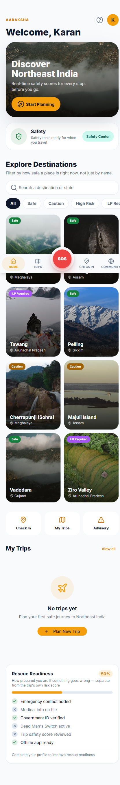</td>
<td width="25%">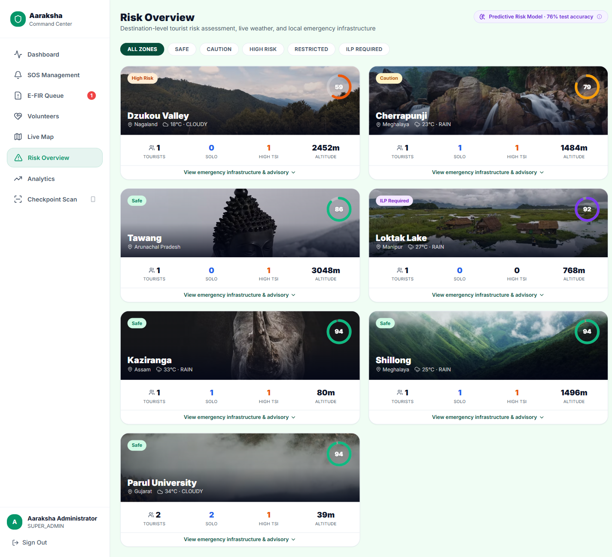</td>
<td width="25%">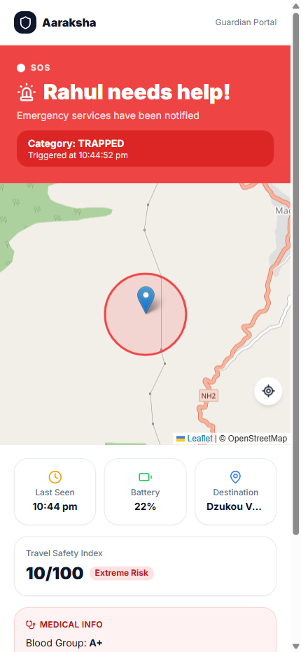</td>
<td width="25%">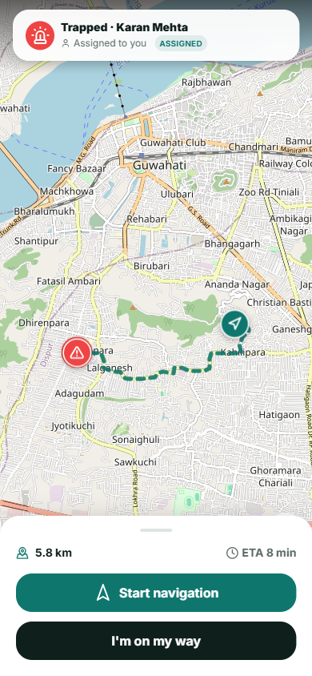</td>
</tr>
<tr>
<td align="center"><sub>Tourist PWA — dashboard</sub></td>
<td align="center"><sub>Govt Command Center — risk overview</sub></td>
<td align="center"><sub>Guardian Portal — live SOS state</sub></td>
<td align="center"><sub>Aaraksha Sahayak — live road route</sub></td>
</tr>
</table>

---

## ⭐ Feature walkthrough

### 🧭 Planning
- **Multi-stop itineraries** built from a real destination catalog (19 Northeast India destinations across all 8 NE states, each with live weather, altitude, connectivity rating, ILP requirements, and nearest-hospital/police data)
- **Destination Detail Pages** — tapping a destination in Explore opens a real, documentary-style page (photo gallery, live weather, curated highlights, verified local providers, real traveller reviews, government-approved multi-day itineraries — see below) instead of dropping straight into the trip-creation form the way it used to; learning about a place and planning a trip to it are now two different, honestly separate actions
- **AI Travel Assistant — "Build My Journey"** — describe a trip in plain language, review a confirm screen with an edit fallback and a chat box to refine before anything's built, get back a real, costed, safety-scored itinerary from a deterministic scorer over curated destinations/routes/reviews, with Gemini only narrating the already-computed numbers — see [AI Travel Assistant](#-ai-travel-assistant--plan-adjust-and-track-a-journey) below
- **AI-assisted trip adjustment** — tell an already-committed trip what changed ("I have ₹4,000 less", "remove Cherrapunji") and review a full before/after proposal before anything is saved; the server recomputes cost itself on apply, never trusts a client-supplied number
- **Per-stop detail, mark-as-visited, and a progress timeline** — tap a stop for its full destination info and every curated way to reach it (train/bus/shared-taxi), mark it visited with an editable spend estimate, and watch a real "what's done, what's next" timeline as the trip progresses — marking the last stop visited prompts to close the trip out
- **Pause and resume a trip** — activating a second trip auto-pauses the first instead of blocking it, so switching between two live plans doesn't mean cancelling one
- **AI-generated packing lists** via Google Gemini, with a static offline fallback so the feature never hard-fails
- **Budget tracking** per trip, category breakdowns, plus a running "spent so far" total from visited stops
- **Group trips** — invite codes, join-by-code, shared itinerary, member roster
- **Digital Journey Passport** — a PDFKit-generated trip summary (itinerary, safety events, check-in history) a tourist can download or share, with a tamper-evident **SHA-256 integrity hash chain** printed on the last page — see [Verifiable Digital ID](#verifiable-digital-id--the-journey-integrity-hash) below

### 🏨 Local Tourism Providers
- **Government-verified local business directory** — real hotels, homestays, registered guides, and artisan/handicraft cooperatives across all 8 Northeast Indian states, each with a checkable citation (an official state tourism/handicrafts/cooperative department page, or an OpenStreetMap node) and a govt operator's sign-off before it's ever shown to a tourist — see [Local Tourism Providers](#-local-tourism-providers--the-tourism-industry-pillar) below for the full pillar
- **Surfaced inside the trip, not a separate directory app** — a stop's detail sheet shows every verified provider at that destination directly, and the AI Travel Assistant's itinerary results carry a live count per stop, so discovery happens exactly where a tourist is already deciding where to go
- **Two-sided trust, shown honestly** — a "✓ Government Verified" badge and a "Source: {citation}" line are always two separate, distinct facts on every card — who confirmed it, and where the underlying data came from — never merged into one unverifiable claim
- **Call or WhatsApp, directly** — every provider card carries both a tap-to-call and a WhatsApp deep link, so a tourist reaches the actual business, not a directory middleman
- **Operator Self-Service Portal** — once verified, a business gets its own login (a government-issued account on Aaraksha Sahayak, gated by a distinct `account_type`) to manage its own listing (contact, description, price range, an artisan-style story, self-reported sustainability tags), post insider tips that surface on the destination page, run a booking-request inbox, and define Explorer-point perks a tourist redeems in person — a static directory that businesses can now actually operate, not just appear in
- **A real, live "Tourism Ecosystem Coverage" dashboard** for government operators — verified-provider counts by category and by district/destination, computed from the same data a tourist sees, not a separate vanity metric
- **Government-approved multi-day itineraries** — 16 real, sourced routes, two per Northeast state, three carrying an actual government-tourism-board citation (not a vague "approved" claim): Meghalaya Tourism's own published Shillong–Cherrapunji route, Sikkim Tourism's own Gangtok–Pelling package, and the Assam Tourism Development Corporation's own "Circuit 1" through Majuli–Jorhat–Kaziranga. Every other route — including a second, shorter/focused itinerary now added to all 8 states (e.g. a 3-day Kaziranga-only safari trip alongside the longer wildlife-and-culture circuit) — gets an honestly-labeled Aaraksha-assembled source instead of a fabricated government endorsement; a real search for citations on the other five states' official tourism sites came up empty rather than guessed, and stayed that way rather than force a citation that isn't real. Same two-distinct-facts discipline as provider cards, applied to itineraries. "Use this itinerary" pre-fills a real trip, ready to review and adjust, not just a static suggestion

### 🚨 Safety
- **One-tap SOS** — hold-to-confirm button, 7 incident categories, GPS-first with a last-known-location fallback
- **Voice-triggered SOS** — the Web Speech API listens for a wake word plus a distress phrase (English "help"/"emergency"/"sos", or the Hindi "bachao" alone, distinctive enough not to need a wake word) and opens a real confirm dialog with vibration feedback — SOS only actually fires on explicit confirmation, never automatically from voice alone; a deliberate design choice after an earlier phone-shake gesture trigger was removed for being unreliable with the screen off in a web PWA
- **Dead Man's Switch** — set a check-in interval before entering low-connectivity terrain; miss it, and the system auto-fires an SOS with your last known location, no action required from you
- **Travel Safety Index (TSI)** — a 0–100 score per destination, rule-based from route difficulty, altitude, connectivity, season, and live OpenWeatherMap data, recalculated hourly by a cron job and pushed live over Socket.IO
- **Offline SOS** — the mechanism this whole platform is built around: a tourist with zero data coverage sends a structured SMS (`AARAKSHA_SOS|ID:...|LAT:...|LNG:...|CAT:...|BATT:...|TIME:...`), a Twilio inbound webhook parses it, and a full SOS event is created exactly as if it came through the app
- **Emergency contact OTP verification** — contacts confirm consent before being registered, closing a real privacy gap
- **Verhoeff-validated Aadhaar** — registration checks the actual UIDAI checksum algorithm on the 12th digit, catching a mistyped Aadhaar number that format-only regex validation would silently accept
- **Privacy & Data Rights page** — see [DPDP Act compliance](#legal--compliance) below
- **Rescue team ETA** — once a team is dispatched, the tourist sees live status and estimated arrival, not silence
- **Weather-triggered risk alerts** — a sudden weather-driven TSI drop pushes a real-time alert to anyone with that destination on their itinerary
- **Web push notifications** — critical alerts reach tourists even when the app isn't open
- **AI Safety Briefing** — Gemini explains an *already-computed* TSI score in plain, route-specific bullet points on request (never scores or decides anything itself), collapsible so it doesn't lengthen the trip page's scroll, with an offline fallback summary when the AI call fails
- **Digital Tourist ID** — a passport-style card wrapping the same rotating, 5-minute-expiry checkpoint QR a govt officer scans, deliberately not a static ID image so it can't be screenshotted and reused
- **Geo-fencing zone alerts** — a one-time toast when live GPS enters a HIGH\_RISK / RESTRICTED / ILP\_REQUIRED stop on an active trip
- **Rule-based anomaly detection** — a minute-cadence cron flags any active trip that's gone quiet for 6+ hours or drifted 60+ km from every planned stop, *before* anyone presses SOS — explainable thresholds, not a black-box model, matching this platform's own honesty standard for TSI
- **File an E-FIR** — a formal, case-numbered report (theft, harassment, fraud, lost documents, and more) for something that already happened, filed straight from the Safety Center and tracked through to resolution — distinct from the SOS button, which is for an emergency happening *right now*
- **On-device photo evidence for E-FIRs** — attach a photo and a real COCO-SSD object-detection model (TensorFlow.js, lazy-loaded, not part of the main bundle) runs entirely in the browser, tags what it sees, and — only for categories with genuine visual signal — suggests a category, always overridable, never forced. The photo never leaves the device until the report is actually filed

### 🚑 Unified Rescue Network
- **One assignable rescuer pool** — official rescue teams and govt-verified citizen volunteers, **weighted-score-ranked** (not just distance-sorted) in a single govt dispatch panel, badge-differentiated "Official" vs "Volunteer" — a "Recommended" pick surfaces the top candidate with its full score breakdown (distance, SOS-category-to-team-type fit, reputation), one tap to pre-select, operator always makes the final call
- **Govt-side volunteer onboarding** — review a citizen's self-registration through an explicit identity-confirmation dialog, *or* provision a walk-in responder's account directly with a one-time password, generated and shown once
- **Real OSRM road routing** — every rescuer-to-SOS line on every portal (Rescuer app, Guardian, tourist) is an actual road route, not a straight line, with a graceful straight-line fallback if the routing service is unreachable
- **Live GPS streaming** — a rescuer's position updates over Socket.IO roughly every 9 seconds while en route, moving the marker on the tourist's, guardian's, and govt operator's map without a page refresh
- **Anti-fraud handoff verification** — closing an SOS is blocked at the database level until the rescuer has the tourist's own 6-digit code (HMAC-SHA256 hashed, 3-attempt lockout, timing-safe comparison — the exact same primitive as password-reset OTPs, reused rather than reinvented) *and* their live GPS is within 250m of the tourist's last known position. A govt operator can still force-resolve a genuine edge case (tourist unconscious, phone dead) — but only with a required, logged reason stamped to the record, never silently
- **Self-service status, govt-owned resolution** — a rescuer reports their own `EN_ROUTE`/`ARRIVED` progress; closing the incident stays an exclusive govt-operator action, matching how a real emergency response chain of custody works
- **Honest decline/cancel, not silent ghosting** — a rescuer who can't take the job anymore exits with a required reason: `DECLINED` if they hadn't started moving yet, `CANCELLED` if they were already en route, each labeled honestly rather than collapsed into one vague status. The SOS immediately reverts to `ACTIVE` in govt's queue for reassignment (unless another rescuer is already on it), and tourist/guardian/govt all get a real-time explanation instead of a stale "still coming" marker. Locked once the handoff code is already verified — a rescuer can't back out after confirming they physically reached the tourist
- **In-app messaging with the rescuer** — a real-time chat thread scoped to the active assignment, right beside the existing call button on both ends; a declined, reassigned, or already-resolved rescuer is rejected from posting (the same live-assignment check every other rescuer endpoint already enforces), so a stale conversation can't be mistaken for a current one

### 🖥️ Government Operations
- **Live ops map** (Leaflet + Socket.IO) — every active tourist, every open SOS, every rescuer currently en route with their real OSRM road route, and every open **anomaly flag** (gone-quiet / off-route), all updating in real time, no refresh — plus a toggleable **Risk Density layer**, weighted circles showing where active trips are concentrated per destination, colored by zone type
- **Real 3D terrain view** — a one-tap toggle switches the same live data onto genuine elevation relief (MapLibre GL JS + free AWS-hosted elevation tiles, no paid API key), so a dispatcher can see whether a mountain ridge actually separates a rescuer from an active SOS, not just their flat map distance
- **SOS triage & rescue assignment** — dispatch to the nearest available team *or* volunteer, status tracked live through `EN_ROUTE → ARRIVED → RESOLVED`
- **Auto-generated SOS incident reports** — once an SOS is resolved or marked a false alarm, a one-click PDF pulls the full case together: tourist details, response timeline, dispatching officer, rescuer, resolution notes, and the trip's known check-in trail — internal record-keeping for a closed emergency, not a substitute for a formal FIR
- **E-FIR Queue** — a genuinely distinct workflow from the SOS incident report above: a role-based officer triage queue for the E-FIRs tourists file (see [Safety](#-safety)), with priority sorting, self-assign or reassign, an investigation status ladder (`FILED → ASSIGNED → UNDER_INVESTIGATION → RESOLVED/CLOSED`), notes at every step, and a downloadable case-record PDF — real-time on both sides, so a filed report reaches the queue and a status change reaches the tourist over Socket.IO, not on the next page refresh
- **Anomaly review** — the same open-anomaly list feeding the map's markers, with a one-click resolve once an operator has checked in on the tourist
- **Volunteer verification & roster** — a pending-review queue with full identity detail before granting dispatch access, plus a live roster showing every volunteer's status and reputation points
- **District risk overview** — per-destination live tourist counts, weather, TSI distribution, a **genuinely trained Predictive Risk Model** (logistic regression, real gradient descent, real train/test accuracy — a second, distinct signal from the rule-based TSI/zone score, both clearly labeled as what they are), and a direct "Post News / Alert" action that fans out to every tourist with that destination on an active itinerary
- **Checkpoint QR scanning** — camera-first scan of a tourist's rotating QR code resolves their full safety profile at a physical checkpoint (ILP posts, park entrances) in one tap, manual entry as a fallback, not the default — every scan is also chained into that trip's Journey Integrity Hash (see below)
- **CCTNS/BNS-aligned E-FIR reference** — every filed E-FIR carries an advisory applicable-section reference under the Bharatiya Nyaya Sanhita, 2023 (India's penal code) or the relevant act, shown on the queue and the case PDF — reads as aligned with how a real police record is classified, not a generic bug-tracker category
- **Analytics & reporting** — incident trends, category breakdowns, average response time, exportable as a real PDF with one click
- **Role-scoped access** — super admin, district admin, police, tourism officer, medical, and checkpoint officer roles, each seeing only what their role needs

### 🌐 Community & Live Content
- **Rich destination reviews** — ratings plus structured detail (actual cost, time spent, crowd level, felt-safe flag, transport/food/accessibility ratings, liked/disliked notes, photos) — not a star rating in a vacuum
- **Scam / safety reports** — community-sourced, filterable per destination
- **Community Safety Hotspots** — the destinations with the most reports in the last 90 days, surfaced above the report form itself so a tourist sees the pattern before they even file one
- **Curated, rotating destination news** — a ~45-item hand-written bank across all 10 destinations, rotated in on a time-slot schedule so the feed visibly changes over a multi-day demo without needing a live news API key
- **A real News & Alerts feed page** — not just a two-item Dashboard preview: a dedicated, filterable (by state, by severity) feed across every destination, real pagination, with the tourist's own active trip's news pinned boldly at the top in its own section — reached from Dashboard's "Latest Alerts" View All, which used to route into a single trip's News tab instead of a real feed
- **Risk overview in the tourist app too** — the same live "how many people are here right now, and how risky is it" view the government dashboard has, surfaced directly to travelers deciding where to go next

### 👪 Guardian Portal
- **Zero-friction access** — a cryptographically random token in the URL, no login, works the instant it's opened
- **Five status states**, each visually distinct: safe, check-in-due warning, SOS active, help-dispatched (amber, distinct from a raw SOS), and no-signal
- **Live rescuer tracking** once help is dispatched — the assigned team or volunteer's real-time position and road route to the traveler, the same picture the govt operator sees
- **In-app messaging with the traveler** — always available, not gated on an active SOS; a real-time chat thread reachable straight from the tracking screen, no login required to send or read it
- Live location on a Leaflet map, battery level, medical info (blood group, conditions), auto-refresh every 30s

### 📴 Offline-first
- **IndexedDB (Dexie.js)** queues SOS events and location pings when the tourist app itself is offline, syncing the moment connectivity returns
- **Cached safety guides** — nearest hospital, police, and rescue team contact stay available even with no signal
- Every safety mechanism above degrades gracefully rather than failing outright when a network or third-party API isn't available

---

## 🔗 Verifiable Digital ID — the Journey Integrity Hash

"Blockchain-based Digital ID" is where this project started — SIH25002's own phrasing — and it
stayed in scope even after moving to the self-defined Student Innovation category, because the
research above turned up the same pattern repeatedly: most public implementations of that exact
phrase turn out to be a QR code pointing at a static profile — nothing chained, nothing
tamper-evident, nothing a third party could actually verify without trusting the app's word for
it. Aaraksha implements the actual primitive blockchain is built on — a cryptographic hash
chain — over every fact that makes up a tourist's verified journey, without the operational
overhead of standing up a real distributed ledger for a single-organization system that doesn't
need one.

**How the chain is built**, straight from `passport.service.js`:

1. **Genesis block** — a SHA-256 hash of the trip's own unchanging facts: destinations, dates,
   travel type, budget, and the TSI score at booking time.
2. **Every check-in, SOS event, and government checkpoint scan**, merged into one true
   chronological sequence (they live in three separate tables and are fetched pre-sorted in
   different directions, so the merge itself is re-verified by timestamp — not trusted as
   already-interleaved) and folded one at a time: `hash(n) = SHA256(hash(n-1) + event(n))`.
3. **The final hash** is printed on the Journey Passport PDF and independently recomputable at
   any time from live platform records via `GET /journey-passport/:tripId/hash` — a bad actor
   would need to alter platform data itself and get every downstream hash to still match, not
   just edit a PDF.

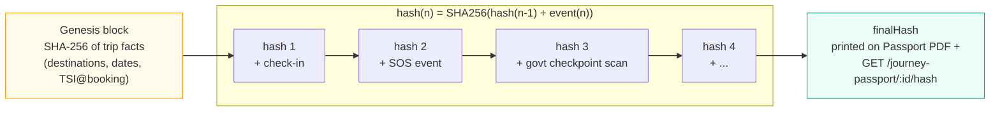

**Why the checkpoint-scan link matters most.** A government checkpoint scan is the one event in
this chain that a citizen doesn't control — it's a police or ILP officer's own physical
verification of the tourist, at a specific place and time. Chaining it into the same hash as the
tourist's self-reported check-ins means the *government's own record* becomes part of the
tourist's cryptographic identity trail, not a separate, disconnected log table nobody
cross-checks. That's the "Digital ID" claim actually made concrete.

**Verified live**, not just claimed — this is a table any judge can watch you reproduce in front of
them:

| Step | `finalHash` | `eventCount` | `checkpointScanCount` |
|---|---|---|---|
| Before scan | `9952f113…c8947` | 3 | 0 |
| Officer scans the tourist's checkpoint QR | `e4e3b7d8…125bf` | 4 | 1 |
| Re-fetched again, nothing changed | `e4e3b7d8…125bf` *(identical)* | 4 | 1 |

The hash changes exactly once, exactly when a real event happens, and is byte-for-byte
deterministic on every subsequent fetch — the two properties that make a hash chain actually
mean something instead of just sounding like it does.

---

## 🤖 A real trained model — the Predictive Risk Score

> **Not a prompt. Not an API call to someone else's model. A model *we* wrote, *we* trained, and
> *we* can show you the loss curve for.**

Gemini in this platform is deliberately never asked to score or decide anything — it only
explains an already-computed number in plain language (see the AI Safety Briefing below), the
same "AI never makes the call, only explains it" honesty stance TSI is built on. That leaves a
fair question: where's the actual machine learning? Here:

`backend/scripts/trainRiskModel.js` trains a real binary logistic regression —
`backend/src/ml/logisticRegression.js` is the entire model, about 90 lines of batch gradient
descent on L2-regularized cross-entropy loss, **no scikit-learn, no TensorFlow, no ML framework
in between — the math is ours.** No public, destination-level tourist-incident dataset exists for
India to train against, so rather than falsely claim one, the trainer generates a labeled corpus
from a probabilistic incident-rate function over real, already-collected destination risk factors
(connectivity, difficulty, altitude, zone classification, hospital distance, monsoon season) —
stated plainly in both the training output and the live UI tooltip, not hidden. The training
pipeline itself doesn't change the moment real incident records exist to train on instead; only
the label source would.

**📊 Benchmark — a real training run, from the actual console output:**

| Metric | Score | | Metric | Score |
|---|---|---|---|---|
| 🎯 Test accuracy | **75.6%** | | 🧪 Training corpus | 4,000 examples |
| 🔍 Precision | **69.0%** | | ✂️ Train / test split | 3,200 / 800 |
| 📡 Recall | **48.5%** | | 🔁 Reproducibility | Seeded — bit-identical every run |
| ⚖️ F1 score | **0.57** | | 🧩 Engineered features | 17 |

| Sanity check | Predicted incident probability |
|---|---|
| 🟢 Kaziranga *(safest seeded destination)* | 22.5% |
| 🔴 Dzukou Valley *(most extreme seeded destination)* | 74.7% |

The learned weights are directionally sane on inspection — `monsoon_season`, `connectivity_NONE`,
and `difficulty_EXTREME` are the three largest positive contributors, `difficulty_EASY` and
`connectivity_GOOD` the largest negative ones — which is exactly what a real fit against
risk-grounded labels should produce, not a random or overfit result. Every prediction shown in
the govt Risk Overview page is explainable down to its top four contributing features, live, not
just a bare percentage — reproduce the whole run yourself with `npm run train:risk-model`.

---

## 🧭 AI Travel Assistant — plan, adjust, and track a journey

> **The same honesty boundary the Predictive Risk Score is built on, applied to trip planning: AI
> explains, it never decides.** Every cost, duration, and safety number a tourist sees came out of
> a deterministic scorer this team wrote — Gemini's only job is to narrate a number that already
> exists, in plain language, never to invent or adjust one itself.

A floating assistant (bottom-right, every tourist screen) turns "plan a Northeast India trip" from
a multi-hour research task — the actual problem this feature targets — into a single conversation,
without ever hiding the real numbers behind the AI's prose.

**1. Describe a trip, and confirm it — the form is a fallback, not the default path** — free text
("6 days in Meghalaya from Delhi, under ₹20,000, mostly nature") pre-fills
origin/region/days/budget/interests via Gemini intent extraction and lands directly on a
read-only confirm screen, not the raw structured form. From there: **Edit details** drops into
the full field-by-field form for anything the extraction missed, or a chat-style box underneath
takes a follow-up ("make it 3 days shorter") and re-scores before anything is built — the same
propose-then-apply discipline point 4 below uses for an already-committed trip, applied one step
earlier, to the plan itself.

**2. A deterministic scorer builds the itinerary** — `travelScoring.service.js` is pure,
synchronous, and network-free: it greedily orders candidate destinations by geographic proximity,
then scores the whole itinerary on budget fit, duration fit, interest-keyword match, a
backtracking-distance penalty, verified-local-provider coverage per stop, and a real Travel Safety
Index pass (`tsi.service.js`) per stop. Real curated `typical_routes` legs are used where they
exist; an uncurated pair falls back to a haversine-distance estimate, **always flagged
`estimated: true`** in the response, never presented as a measured fact.

**Verified local providers are now a real planning signal, not just a display-time count** — a
stop with government-verified hotels/homestays/guides/artisans contributes to the itinerary's
overall score (saturating at 3 verified operators per stop, so one dense district can't dominate
the whole score), at a deliberately modest 10% weight so it nudges toward better-served
destinations without overriding budget, safety, or a tourist's stated interests. This was held back
from the first pass that stood up the provider dataset — done only once there was enough verified
depth (44 real operators across all 8 states) for the signal to mean something, with its own test
coverage added alongside it, not bolted on after.

**3. Gemini narrates the result** — `generateJourneyNarrative` receives the already-computed
itinerary and writes the "why this route" bullets and journey story; it cannot alter the stops,
cost, or score it's describing. If the Gemini call fails, a templated fallback narrative takes
over and says so (`narrativeSource: 'TEMPLATED_FALLBACK'`) — the number underneath never changes
either way.

**4. Adjusting an already-committed trip is propose-then-apply, never direct** — a natural-language
edit ("remove Cherrapunji", "I have ₹4,000 less now") returns a full before/after comparison the
tourist reviews first. Applying it sends only destination **identity** (stop IDs + day count) back
to the server, which recomputes `totalCostInr` itself via the same deterministic scorer — a
client-supplied cost number is never trusted or persisted, closing the exact kind of gap that lets
a tampered request silently under-report a trip's real cost. A real bug lived here until it was
traced and fixed: a relative phrase like "₹4,000 less" asked Gemini to both *understand* the
change and *do the arithmetic* against the current budget in one step, and LLM sampling variance
on that second part is exactly why it "sometimes worked" — Gemini now only reports a signed delta
or an absolute value, never the arithmetic result, and `gemini.service.js#resolveDeltas` (with its
own unit tests, no live API call needed) applies it deterministically server-side.

**5. Once committed, a stop becomes a real place to explore** — tapping it opens full destination
info (description, best season, government advisory, nearest hospital) plus every curated route to
reach it from the previous stop, train/bus/shared-taxi options included where the dataset has them.
Marking a stop visited pre-fills an honest, editable spend estimate (an even share of the trip's
planned budget — there's no bank/UPI integration behind this, so it's disclosed as an estimate, not
a claim of a known real number) and updates a real progress timeline and a running "spent so far"
total, not a static itinerary that never changes once booked. Marking the last stop visited prompts
to close the trip out — a real gap this closed: a trip used to stay `ACTIVE` forever with nothing
ever detecting "every stop is done," since that transition was manual and undiscoverable.

**6. A trip can be paused and resumed, not just abandoned** — activating a second trip while one is
already active no longer throws an error; it auto-pauses the first (a real `PAUSED` status, its own
tab on the trips list) so a tourist genuinely juggling two plans — a short detour while a longer
trip is paused, say — can switch between them without cancelling either one.

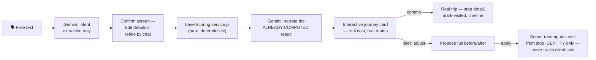

**The dataset behind it is curated, not scraped or invented.** `typical_routes` and
`destination_reviews` grow through a supervised multi-agent process documented in
[`chatbot.md`](./chatbot.md) — every route requires a `source` (a named government/OSM reference,
a cited article, or `destination_reviews` real traveller data; proprietary booking platforms are
explicitly off-limits), reviewed before insertion, with every session logged. All 8 Northeast
states currently have 2–3 sourced destinations and at least one sourced intra-state route.

| Layer | What it does | Where |
|---|---|---|
| 🧮 Deterministic scorer | Budget/duration/interest fit, backtracking penalty, verified-provider coverage, per-stop TSI — pure function, unit-tested, no network | `travelScoring.service.js` |
| 🗣️ Intent extraction | Free text → structured form fields; never bypasses tourist confirmation | `gemini.service.js#extractPlanningIntent` / `#extractTripIntent` |
| ✍️ Result narration | Explains numbers already computed; offline-fallback narrative if the AI call fails | `gemini.service.js#generateJourneyNarrative` |
| 🔁 Propose-then-apply | Adjustment is scored and shown before any write; apply recomputes cost server-side from stop identity only | `travelPlanner.service.js#adjustTrip` / `#applyTripAdjustment` |
| 🛣️ Route data | Curated legs between destinations, multiple modes per pair where sourced; uncurated pairs get a flagged haversine estimate | `typical_routes`, `travelPlanner.repository.js#findRoutesBetween`/`#findRoutesAmong` |
| 📚 Dataset provenance | Multi-agent curation spec, Tier A/B/C source policy, required `source` column | [`chatbot.md`](./chatbot.md), migration `026_travel_data_provenance` |

---

## 🏨 Local Tourism Providers — the tourism-industry pillar

SIH PS 26204 asks for a solution that can *"boost the current situation of the tourism industries
including hotels, travel and others."* The AI Travel Assistant above answers "travel." This is
the direct answer to "hotels ... and others" — and it was built the same way everything else in
this README was: with a real trust boundary, real sourced data, and an explicit decision about
what *not* to build.

**The decision, stated plainly:** this is a **discovery and trust layer, not a booking platform.**
No payments, no inventory, no availability calendar — building an OTA clone would be a different,
much larger product, and isn't what an open-innovation PS asking to *boost* an industry is
requesting. What Aaraksha adds instead is the thing that's actually missing: a way for a real
local hotel, homestay, guide, or artisan cooperative to be **discoverable and trustworthy** inside
the exact moment a tourist is planning their trip.

**The trust model is borrowed on purpose, not invented from scratch** — a "local provider" needs
the same shape of trust this platform already proved out for **citizen rescue volunteers**: a
real-world identity with a checkable citation that is *not* safe to surface to a tourist until a
government reviewer has verified it. Same reasoning, same review queue pattern, same "citation
alone isn't enough" discipline — just a different actor.

| Stage | What happens | Where |
|---|---|---|
| 🔎 Sourced | A real hotel/homestay/guide/artisan cooperative, cited from an official state tourism/handicrafts/cooperative department page or an OpenStreetMap node — never a booking aggregator (OYO, MakeMyTrip, Airbnb, TripAdvisor, Booking.com are explicitly banned as sources) | `chatbot.md`'s "Local Tourism Enablement" section, `local_operators.source` (`NOT NULL` at the DB level) |
| ⏳ Pending | Inserted `is_verified = false` — real and cited is not yet the same as safe-to-surface | `local_operators` table, migration `027_local_operators` |
| ✅ Verified | A government operator reviews the citation and approves it in the Command Center — the same identity-confirmation discipline as volunteer onboarding | `POST /govt/local-operators/:id/verify`, `LocalOperatorsPage.tsx` |
| 📲 Visible | Only verified, active providers are ever returned to a tourist — enforced as a hard-coded `WHERE is_verified = true` in the repository layer, not a frontend filter | `localOperator.repository.js#findByDestinationId`, `StopDetailSheet.tsx`, `JourneyResultCard.tsx` |
| 🔑 Account issued | Optionally, a govt reviewer can also generate a login for the verified business — reuses the existing volunteer/rescuer auth table via a distinct `account_type` (`RESCUER` vs `OPERATOR`) and a role-scoped JWT, rather than a second parallel auth system | `POST /govt/local-operators/:id/create-account`, `requireAccountType()` middleware, `OperatorDashboardPage.tsx` |
| 📊 Discovery measured, not assumed | Every real, *committed* trip (not a preview) logs which verified providers its itinerary actually surfaced — a real "did this boost visibility" count per operator for the tourism department, not a vanity number, and it fails silently (logged, never blocking) if the write itself ever has a problem | `provider_itinerary_impressions` table, `travelPlanner.service.js#commitJourney`, `GET /govt/local-operators/analytics`, `LocalOperatorsPage.tsx` |

**Two distinct facts, always shown as two distinct lines** — every provider card carries a
"✓ Government Verified" badge (who confirmed it) and a separate "Source: {citation}" line (where
the underlying fact came from). They're deliberately never merged into one sentence: a citation
being real isn't the same claim as a government reviewer having signed off on it, and this
platform doesn't blur the two just to make a card read cleaner.

**Real numbers, not a seed script's placeholder count** — as of this build: **44 real, cited
providers across all 8 Northeast Indian states**, every state represented in every category this
dataset defines (15 hotels, 14 homestays, 9 registered guides, 6 artisan/handicraft cooperatives)
— including an independently-confirmed individual guide in every single state, not just an
association — 40 already government-verified, a handful deliberately left pending as a genuine,
uncoached verify-it-live moment rather than a staged demo. Every citation is independently checkable —
official OSM node/way IDs, or a named government department page — the full research and
verification trail (including one caught and corrected citation, left in the log rather than
quietly fixed) is in [`chatbot.md`](./chatbot.md)'s session log.

<p align="center">
  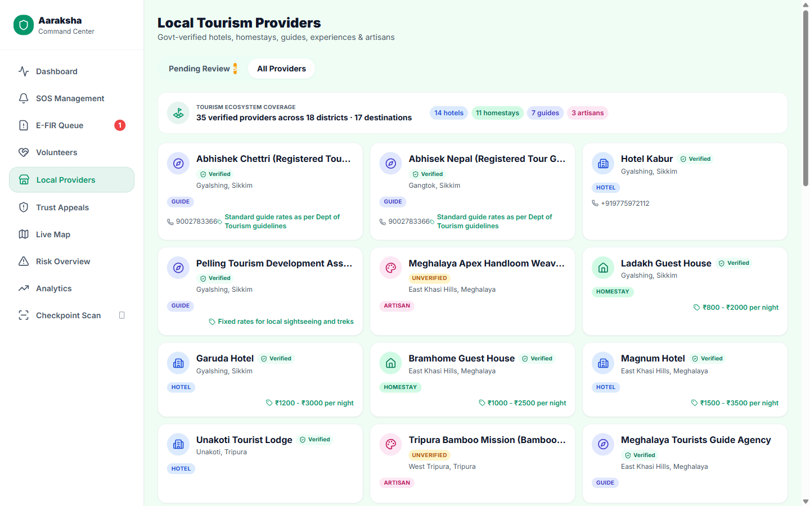
</p>
<p align="center"><sub>Govt Command Center — verified-provider roster and live Tourism Ecosystem Coverage dashboard</sub></p>

<p align="center">
  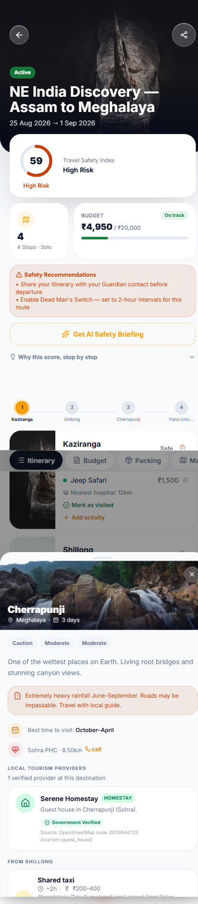
</p>
<p align="center"><sub>Tourist PWA — verified local providers surfaced directly on a trip stop</sub></p>

---

## 🚑 The unified Rescuer network

Two kinds of rescuer used to be structurally separate systems: official rescue teams (a shared
phone number, manually dispatched by a govt operator) and citizen volunteers (individually
logged in, only reachable by an automatic proximity broadcast — no manual assignment path
existed, and no live location ever left their registered base). Neither had a real road route or
a live position. This is the actual flow now, end to end — every arrow below is a real Socket.IO
event or API call, not an aspirational diagram:

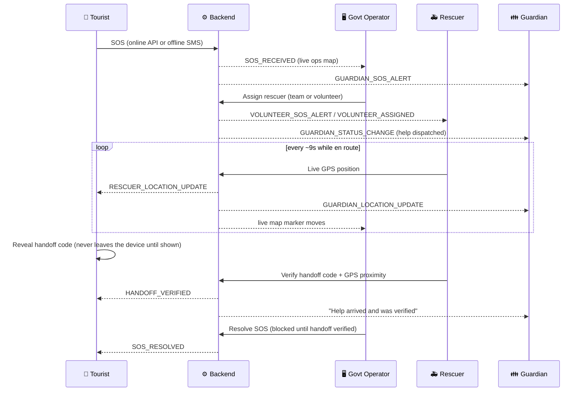

**1. A volunteer gets an account** — either they register themselves in Aaraksha Sahayak, or a
district officer provisions one directly for a walk-in local responder, generating a one-time
password on the spot.

<p align="center">
  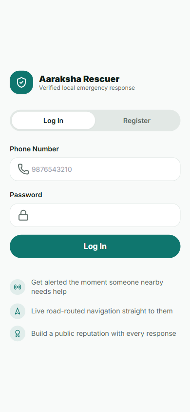
</p>

**2. A district officer verifies their identity** before they're eligible for dispatch — an
explicit confirm step, not a one-click rubber stamp, since verifying grants access to a
tourist's exact live location the moment they're assigned.

<p align="center">
  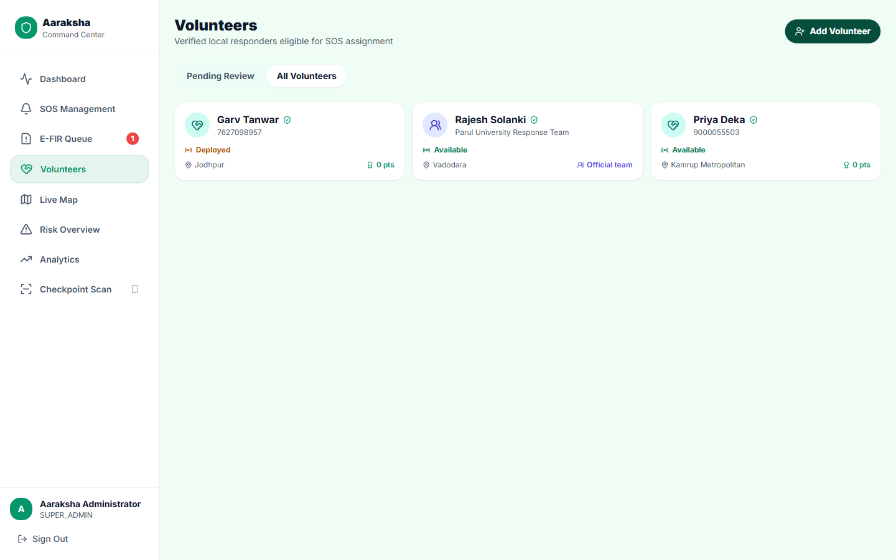
</p>

**3. An SOS comes in, and the govt operator picks a rescuer** — official team or verified
volunteer, in one distance-sorted panel, badge-differentiated so the operator always knows
which kind of rescuer they're sending.

<p align="center">
  
</p>

**4. Aaraksha Sahayak opens straight into a live, full-screen map** — a real OSRM road route to
the person in need (not a straight line), live distance/ETA, one-tap handoff to Google Maps
turn-by-turn, and self-reported `EN_ROUTE` → `ARRIVED` progress.

<p align="center">
  
</p>

**5. The family sees the exact same live picture** — the assigned rescuer's real-time position
and road route, on the same no-login Guardian link they already had open.

<p align="center">
  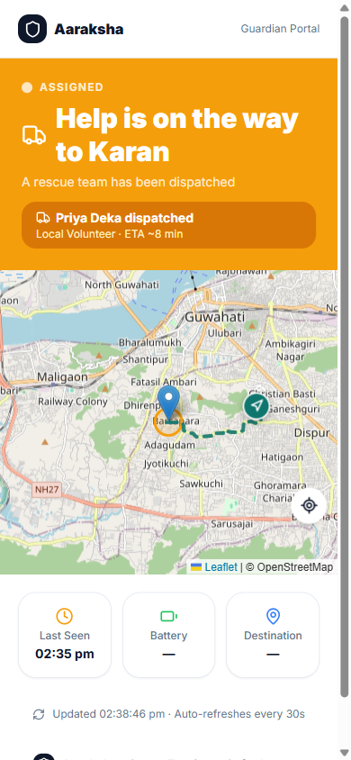
</p>

The rescuer's position streams over Socket.IO into three rooms at once — tourist, guardian, govt
— so all three views move in near-real-time off the same GPS ticks, not three separate polling
loops drifting out of sync.

---

## 🗺️ Routing Engine — OSRM & Contraction Hierarchies

> **Named honestly, not oversold.** The road-routing algorithm is [OSRM](http://project-osrm.org/)'s
> own — we call it, we don't reimplement it. What *is* ours is the resilience and honesty layer
> wrapped around a free public service: throttled requests, a straight-line degrade path, and a
> disclosed answer for the one thing OSRM's public instance genuinely can't see — live traffic.

Every live map in this system — tourist, rescuer, guardian — calls the public OSRM demo server
directly from the browser (`router.project-osrm.org/route/v1/driving/...`, no API key, nothing to
configure) and asks for the `driving` profile. OSRM answers that query using **Contraction
Hierarchies**: the road graph is pre-processed offline into a layered shortcut network, so a
route that would take a naive Dijkstra search seconds to compute over the full OpenStreetMap graph
resolves in single-digit milliseconds at query time. That's genuinely "the best possible path" for
a static road network — this system calls a real, production-grade routing engine, not a
from-scratch shortest-path implementation.

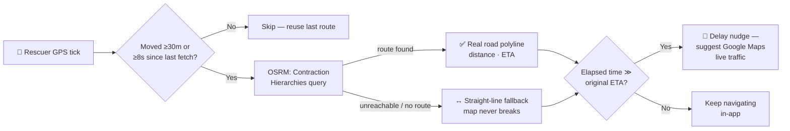

**What's disclosed, not hidden**: OSRM's public instance routes purely on road geometry — it has
no live-traffic layer. Rather than silently present a possibly-stale ETA as gospel, the system
tracks each assignment's *original* computed ETA as a baseline and compares it against real
elapsed time. If a rescuer is still en route at 1.6× their original estimate — a deliberately
generous margin for single-lane mountain terrain, not routine noise — every screen watching that
assignment (rescuer, tourist, guardian) surfaces an honest, actionable nudge: *"Taking longer than
expected — check for a detour, or open Google Maps for live traffic conditions,"* one tap into
Google's own traffic-aware routing. The system never pretends to out-route Google on live
conditions it structurally cannot see — it detects when that's likely happening and hands off.

| Layer | What it does | Where |
|---|---|---|
| 🛣️ Route computation | Contraction Hierarchies over the OSM road graph | OSRM's own public server |
| 🐢 Client-side throttle | Skip a refetch unless ≥30m moved *and* ≥8s elapsed | `lib/osrm.ts`, all 3 live-tracking portals |
| ↔️ Resilience | Any failure (timeout, no route, malformed response) degrades to a straight line, never a crash | `lib/osrm.ts#getRoute` — verified live by blocking the endpoint entirely mid-session |
| 🧭 Delay honesty | Elapsed time vs. original ETA, 1.6× margin, triggers a Google Maps handoff suggestion | `ActiveJobPage.tsx`, `RescueTrackingCard.tsx`, guardian `TrackingPage.tsx` |
| 📡 Live cross-portal signal | Rescuer's "Navigate" toggle broadcasts a real-time pill to tourist + guardian | `RESCUER_NAVIGATING_STATE` socket event |

---

## 🛰️ NTN — a satellite fallback transport

> **Named honestly, not oversold.** Aaraksha does not have a satellite modem, and no browser can
> talk to one — there's no web API for it. What this is: a **software channel simulator** for
> 3GPP Release-17 NTN (Non-Terrestrial Network / direct-to-device satellite), sitting behind the
> exact same SOS pipeline the manual button uses, so the system can demonstrate — honestly, today —
> how it would behave if a real NTN modem existed on the device.

NE India and Kashmir have real terrestrial dead zones — the entire reason Aaraksha exists. 3GPP
Release-17 direct-to-device NTN is a real, near-term answer to that: Apple's Emergency SOS via
satellite, Qualcomm Snapdragon Satellite, and BSNL's own announced Viasat-powered direct-to-device
service for India are all instances of the same idea reaching consumer devices. Aaraksha's SOS
pipeline is built **transport-agnostic** — it doesn't care whether an emergency arrived over the
internet, SMS, or a satellite hop, only that it arrived — so when real NTN hardware lands on
mainstream Indian devices, it's a new adapter behind an existing boundary, not a rewrite.

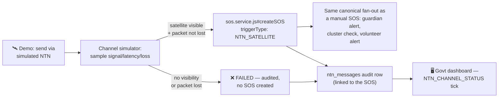

**What's real vs. simulated, stated plainly**: the channel model (signal strength, latency, packet
loss across three named conditions — clear sky, mountain valley, no visibility) is a deterministic
software simulator, with parameters *informed by* documented 3GPP NTN system characteristics and
propagation assumptions — not measured satellite telemetry, and not a claim that 3GPP publishes one
universal real-world number for every terrain type. What's real: the moment a simulated uplink is
marked delivered, it runs through the *exact same* SOS pipeline a manual trigger does — the same
transaction, the same guardian alert, the same proximity-cluster check, the same volunteer
fan-out — recorded end-to-end in an append-only `ntn_messages` audit table and visible live on the
government dashboard's NTN panel.

**Why this and not a real 5G/NTN stack for the prototype**: bringing up OpenAirInterface + Open5GS
in RF-simulation mode is a real integration path (documented below), but it's a multi-week effort
even for teams experienced with telecom stacks, and a browser-based PWA has no way to reach it
directly regardless — any real integration needs a native app or bridge process, a separate project
in its own right. None of that unseen complexity is verifiable in a short demo slot anyway; what's
verifiable is the pipeline shown above, working end-to-end, live.

| Layer | What it does | Where |
|---|---|---|
| 🎛️ Channel simulator | Three named conditions (clear sky / mountain valley / no visibility), each sampling signal/latency/packet-loss within a documented range | `simulators/ntnChannel.js` |
| 📡 Uplink attempt | Simulates the delay, rolls the packet-loss odds, always records the outcome | `services/ntn.service.js#sendViaNTN` |
| ♻️ Pipeline reuse | A delivered uplink calls the same `createSOS` every manual trigger uses — no second, partial copy of the fan-out logic | `services/sos.service.js` (one additive `triggerType` param) |
| 🗂️ Audit trail | Every attempt, delivered or failed, is an append-only row | `ntn_messages` (migration `024_ntn_messages`) |
| 🖥️ Live ops visibility | Signal/latency/loss and recent activity, ticking off a socket event | `NTN_CHANNEL_STATUS`, `NTNPanel.tsx` on the govt dashboard |
| 🔮 Real-hardware integration path | Documented future work, not attempted here: OpenAirInterface + Open5GS in RFsimulator mode, behind the same `ntn.service.js` boundary | Out of scope for this pass |

---

## 📸 Screenshots

All captured live from the running app — real seeded data, not mockups. Full-resolution files
are in [`docs/screenshots/`](./docs/screenshots/), free to drop straight into slides.

**Tourist PWA**

<table>
<tr>
<td width="50%"><p align="center"><sub>Landing page — terrain-themed hero</sub></p></td>
<td width="50%">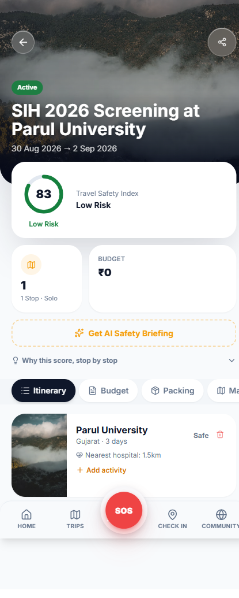<p align="center"><sub>Trip detail — live TSI + destination news</sub></p></td>
</tr>
<tr>
<td width="50%">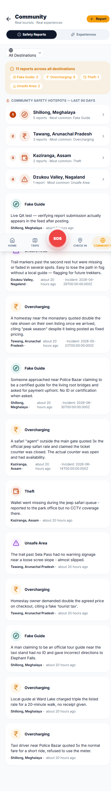<p align="center"><sub>Community — rich destination reviews</sub></p></td>
<td width="50%"><p align="center"><sub>Dashboard — SOS, DMS, active trips</sub></p></td>
</tr>
<tr>
<td width="50%"><p align="center"><sub>Stop detail — verified local providers, badge + source shown separately</sub></p></td>
</tr>
</table>

**Govt Command Center**

<table>
<tr>
<td width="50%">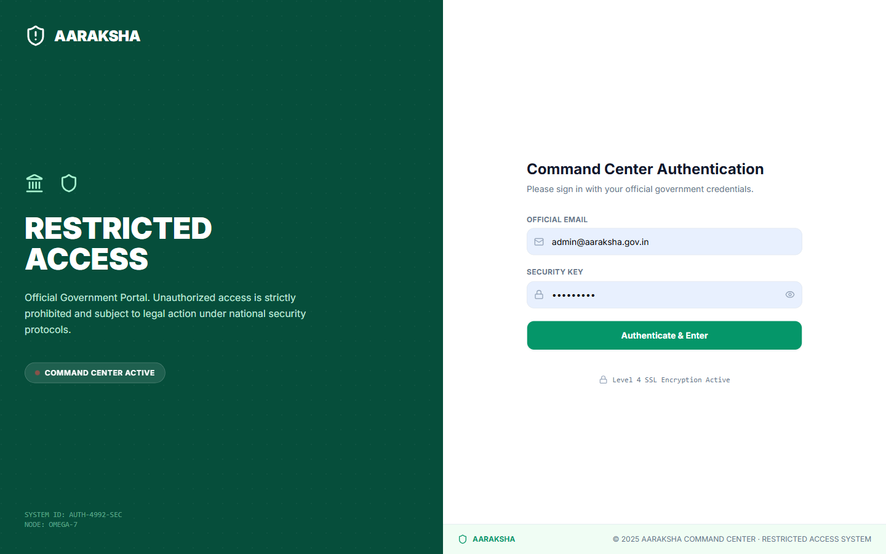<p align="center"><sub>Restricted-access authentication</sub></p></td>
<td width="50%"><p align="center"><sub>Dashboard — live stats at a glance</sub></p></td>
</tr>
<tr>
<td width="50%">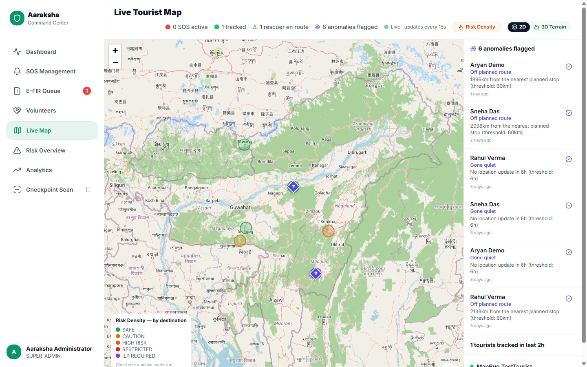<p align="center"><sub>Live Map — every active tourist, real time</sub></p></td>
<td width="50%">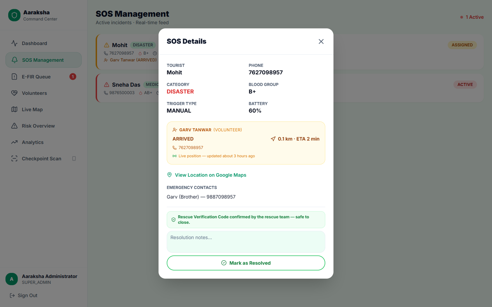<p align="center"><sub>SOS Management — incident triage list</sub></p></td>
</tr>
<tr>
<td width="50%"><p align="center"><sub>Assign Rescuer — official team or verified volunteer</sub></p></td>
<td width="50%"><p align="center"><sub>Volunteers — provisioning + one-time credentials</sub></p></td>
</tr>
<tr>
<td width="50%"><p align="center"><sub>Risk Overview — per-destination live risk</sub></p></td>
<td width="50%">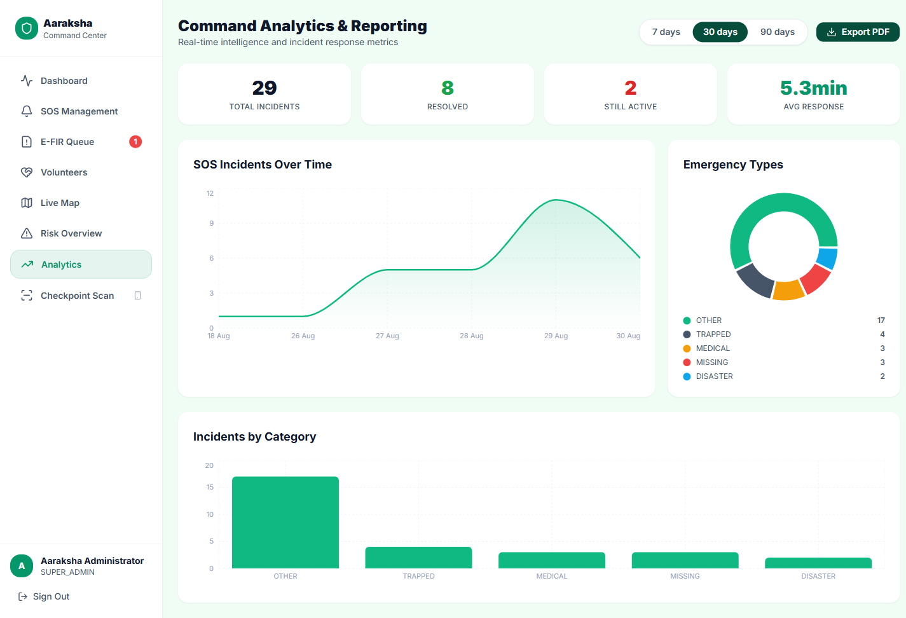<p align="center"><sub>Analytics — incident trends + PDF export</sub></p></td>
</tr>
<tr>
<td width="50%" colspan="2"><p align="center"><sub>Local Tourism Providers — verified roster + Tourism Ecosystem Coverage</sub></p></td>
</tr>
</table>

**Guardian Portal** — mobile view, since this is the link a family member opens on their phone

<table>
<tr>
<td width="50%"><p align="center"><sub>SOS active — no rescuer dispatched yet</sub></p></td>
<td width="50%"><p align="center"><sub>Help dispatched — live rescuer + road route</sub></p></td>
</tr>
</table>

**Rescuer App** — the newest portal, teal to stay visually distinct from the other three

<table>
<tr>
<td width="33%"><p align="center"><sub>Log in / register</sub></p></td>
<td width="33%"><p align="center"><sub>Home — availability toggle, nearby alerts</sub></p></td>
<td width="33%"><p align="center"><sub>Active job — live route + status</sub></p></td>
</tr>
</table>

---

## 🏗️ Architecture at a glance

**Backend stack:** Node.js ≥20 · Express · PostgreSQL (raw `pg`, zero ORM) · JWT + bcrypt ·
Socket.IO · node-cron (DMS checks every minute, anomaly detection every minute, weather+TSI
hourly, news rotation every 20 min) · Twilio (outbound SMS + inbound webhook) · Google Gemini ·
PDFKit · multer (photo uploads) · Zod validation · pino structured logging.

**Frontend stack** (all four apps, independently deployable Vite projects sharing one design
system — see [`UI_GUIDE.md`](./UI_GUIDE.md)): Vite 8 · React 19 · TypeScript 6 · Tailwind CSS
3.4 · shadcn/ui (Radix primitives) · Zustand · TanStack Query v5 · Dexie.js (tourist offline
sync) · react-leaflet (govt live map, Guardian/tourist/Rescuer live-route maps) · MapLibre GL JS
(govt 3D terrain view, free elevation tiles, no API key) · OSRM (real road routing, no API key) ·
TensorFlow.js + COCO-SSD (on-device E-FIR photo tagging) · react-hook-form + Zod · Socket.IO
client · jsQR (checkpoint camera scanning).

Every layer is intentionally narrow: controllers hold no SQL or business logic, all queries live
in repositories, and every multi-table write that must be atomic goes through a single
`withTransaction()` helper. The full mechanism, traced from the actual source, is diagrammed in
[`Aaraksha-Architecture-Diagram.svg`](./Aaraksha-Architecture-Diagram.svg).

---

## 📈 By the numbers

| | |
|---|---|
| **Portals** | 4 (Tourist PWA, Govt Command Center, Guardian Portal, Rescuer App) |
| **API endpoints** | 151, across 19 route groups |
| **Database tables** | 34 |
| **Migrations** | 35, applied incrementally — every schema change is a reviewable, named diff, never a hand-edited table |
| **Destinations seeded** | 19, across all 8 Northeast Indian states (Assam, Meghalaya, Nagaland, Arunachal Pradesh, Sikkim, Manipur, Mizoram, Tripura) — each with real altitude, connectivity, ILP, hospital, and police-station data |
| **Verified local tourism providers** | 40 government-verified (44 total, real and cited) — hotels, homestays, registered guides, artisan cooperatives across all 8 states — see [Local Tourism Providers](#-local-tourism-providers--the-tourism-industry-pillar) |
| **Curated `typical_routes` legs** | 24, each with a required, reviewed `source` — see [AI Travel Assistant](#-ai-travel-assistant--plan-adjust-and-track-a-journey) |
| **Government-approved / curated itineraries** | 16, two real routes per NE state — 3 carrying an actual government-tourism-board citation (Meghalaya, Sikkim, Assam), the rest honestly self-assembled rather than a fabricated approval — see [Local Tourism Providers](#-local-tourism-providers--the-tourism-industry-pillar) |
| **Destinations with curated highlights** | 17 of 19 — sourced "what makes this place unique" facts (Wikipedia, UNESCO, Britannica, official tourism sites), the 2 non-Northeast seed rows excluded |
| **Curated news items** | ~45, hand-written per destination, auto-rotating |
| **Tourist app screens** | 19 routes (landing, auth + forgot-password, dashboard, trip planning + detail with 6 tabs, a real destination detail page, check-in, SOS, checkpoint pass, a filterable news feed, incident reporting, community, advisory, profile + edit + privacy, help) |
| **Govt app screens** | 9 (login, dashboard, SOS management, E-FIR queue, volunteers, live map, risk overview, analytics, checkpoint scan) |
| **Rescuer app screens** | 4 (auth, home, active job — live map, operator dashboard) — the same app now also serves govt-issued local-operator accounts, RBAC-gated from rescuer routes |
| **Cron jobs** | 4 (Dead Man's Switch monitoring, anomaly detection, weather + TSI refresh, destination news rotation) |
| **Real-time events** | 37 distinct Socket.IO event types |
| **SOS incident categories** | 7 (medical, lost, trapped, disaster, missing, crime, other) |
| **E-FIR incident categories** | 8 (theft, harassment, assault, fraud, lost document, vehicle accident, property damage, other) |
| **Rescuer types** | 2 (official rescue teams, govt-verified citizen volunteers) — one assignable pool |
| **Languages** | 3 (English, Hindi, Assamese) — full key parity enforced at dev-time, not just an `en.json` with gaps |
| **Predictive Risk Model** | 1 real trained logistic regression · 4,000-example corpus · 75.6% test accuracy · 17 explainable features |

---

## 📁 Repository layout

```
Aaraksha/
├── README.md                        this file
├── Architecture.md                  locked tech stack, naming, directory conventions
├── API_GUIDE.md                     HTTP verbs, error codes, response envelope
├── DB_GUIDE.md                      table definitions, relationships, query rules
├── UI_GUIDE.md                      design tokens, components, offline strategy
├── chatbot.md                       supervised multi-agent dataset-curation spec — see
│                                     AI Travel Assistant above
├── docs/testing/                    12-phase adversarial QA pass — see docs/testing/README.md
│
├── backend/
│   ├── src/
│   │   ├── app.js                   Express app: middleware chain, routes, error handler
│   │   ├── server.js                HTTP server, Socket.IO init, graceful shutdown
│   │   ├── config/                  env validation, CORS, Gemini/Twilio/push clients
│   │   ├── constants/                enums, error messages, socket event names
│   │   ├── routes/                  17 route modules → controllers (incl. travelPlanner.routes.js,
│   │   │                             ntn.routes.js, incident.routes.js)
│   │   ├── controllers/             thin HTTP handlers
│   │   ├── services/                business logic, transaction boundaries — incl.
│   │   │                             anomaly.service.js, incident.service.js,
│   │   │                             efirReport.service.js, passport.service.js
│   │   │                             (Journey Integrity Hash chain), travelPlanner.service.js
│   │   │                             + travelScoring.service.js (deterministic itinerary scorer)
│   │   ├── repositories/            all SQL, parameterized, one per table cluster
│   │   ├── middleware/              auth (JWT, algorithm-pinned), validate (Zod),
│   │   │                             rate limiting, errors
│   │   ├── validators/              Zod schemas per domain
│   │   ├── socket/                  Socket.IO init + typed emitters
│   │   ├── cron/                    DMS, anomaly detection, weather+TSI,
│   │   │                             destination-news rotation jobs
│   │   ├── data/                    curated destination news bank +
│   │   │                             riskModel.weights.json (frozen trained model)
│   │   ├── ml/                      logisticRegression.js (from-scratch trainer)
│   │   │                             + features.js (shared train/serve encoding)
│   │   ├── database/                connection pool, transaction helper
│   │   └── migrations/              node-pg-migrate schema — 35 tables across 36 migrations
│   ├── scripts/
│   │   ├── preflight.js             env/DB connectivity check before setup
│   │   ├── seed.js                  idempotent demo data (--reset flag available)
│   │   ├── seedDemoContent.js       trips/reviews/scam reports across every demo account
│   │   ├── seedAnalyticsHistory.js  30-day realistic incident history for the analytics dashboard
│   │   ├── seed_destination_highlights.js  real, sourced "what makes this place special" bullets
│   │   ├── seed_curated_itineraries.js     real, sourced govt-approved/curated multi-day routes
│   │   └── trainRiskModel.js        trains the Predictive Risk Model, writes riskModel.weights.json
│   ├── tests/
│   │   ├── unit/, integration/      vitest unit + integration suite
│   │   └── eval/                    travelPlanner.benchmark.js — 6 fixed queries against the
│   │                                 real dev DB, checked for sane scores/safety/backtracking
│   ├── postman/                     Postman collection + environment
│   ├── .env.example                 every required env var, documented
│   └── package.json
│
└── frontend/
    ├── tourist/                     Tourist PWA — :5173
    │   ├── src/pages/               landing, auth, dashboard, trips (create/detail/list),
    │   │                             destinations (real, documentary-style detail page),
    │   │                             safety (SOS/check-in/checkpoint pass/E-FIR filing/news feed),
    │   │                             community, advisory, profile
    │   └── src/components/shared/   TravelAssistantFAB.tsx (Build My Journey / adjust),
    │                                 StopDetailSheet.tsx + DestinationInfo.tsx (shared
    │                                 destination-info rendering — the sheet and the standalone
    │                                 page both use it, not two copies of the same content)
    ├── govt/                        Government Command Center — :5174
    │   └── src/pages/               login, dashboard, SOS management, E-FIR queue,
    │                                 volunteers, live map (incl. anomaly markers),
    │                                 risk overview, analytics, checkpoint scan
    ├── guardian/                    Guardian Portal — :5175
    │   └── src/pages/               tracking page (token in URL, no auth)
    └── volunteer/                   Aaraksha Sahayak — :5176 (folder name predates two
        │                             rebrands; serves two account types under one login —
        │                             RESCUER (home: availability + nearby alerts, active
        │                             job) and OPERATOR (business: listing, story, tips,
        │                             booking requests, perks) — see migration
        │                             034_operator_accounts)
        └── src/pages/               auth, home (availability + nearby alerts),
                                      active job (live map + road route), business
                                      (govt-verified local-operator self-service dashboard)
```

---

## 🚀 Getting started

### Prerequisites
- Node.js ≥ 20
- PostgreSQL ≥ 15 (needs `pgcrypto` for `gen_random_uuid()` — the migration enables it)
- npm

### 1. Clone and install
```bash
git clone https://github.com/aryanf192811-eng/Aaraksha.git
cd Aaraksha/backend
npm install
```

### 2. Configure environment
```bash
cp .env.example .env
```
Fill in `DATABASE_URL` at minimum. `JWT_SECRET`, `GOVT_ID_SECRET`, and `GUARDIAN_SECRET` need
real random values even for local development. Twilio, Gemini, OpenWeatherMap, and Web Push
(VAPID) keys are **optional** — every integration degrades gracefully when unset.

### 3. Set up the database
```bash
npm run preflight     # verifies DATABASE_URL is reachable before anything else runs
npm run migrate       # applies the 24-table schema
npm run seed          # idempotent demo data — safe to re-run
```
Or all three in one shot: `npm run setup`.

Two optional scripts add richer demo content on top of the base seed:
```bash
node scripts/seedDemoContent.js       # more trips, reviews, and scam reports per account
node scripts/seedAnalyticsHistory.js  # 30 days of realistic resolved-incident history
```

The Predictive Risk Model ships pre-trained (`src/data/riskModel.weights.json` is checked in), but
the training run is fully reproducible — `npm run train:risk-model` retrains it from scratch and
prints the full report (loss curve, accuracy, learned feature weights) to the console.

### 4. Run the backend
```bash
npm run dev            # nodemon, auto-restart
```
Starts on `PORT` (default `5000`), logs `GET /health → {"status":"ok"}` once ready.
Socket.IO and all four cron jobs start automatically.

### 5. Run the frontends
Each app is a separate Vite project on a fixed port. In four more terminals:
```bash
cd frontend/tourist   && cp .env.example .env && npm install && npm run dev   # → :5173
cd frontend/govt      && cp .env.example .env && npm install && npm run dev   # → :5174
cd frontend/guardian  && cp .env.example .env && npm install && npm run dev   # → :5175
cd frontend/volunteer && cp .env.example .env && npm install && npm run dev   # → :5176 (Rescuer App)
```
The `.env.example` defaults work out of the box against a local backend. To test from another
device on the same network, point each `VITE_API_URL` / `VITE_SOCKET_URL` at your machine's LAN
IP instead of `localhost` (all four dev servers already bind to `0.0.0.0`). Road routing calls
the free public OSRM demo server directly from the browser — no API key, nothing to configure.

---

## 🌐 Live links

**Deployed (permanent — this is what anyone else testing the project should use):**

| App | URL |
|---|---|
| Tourist PWA | https://aaraksha-tourist.vercel.app |
| Government Command Center | https://aaraksha-govt.vercel.app |
| Rescuer / Local-Operator app | https://aaraksha-rescuer.vercel.app |
| Guardian Portal | https://aaraksha-guardian.vercel.app |
| Backend API | https://aaraksha-backend-znb6.onrender.com |

These are the real, always-on links backed by Render + Vercel — they do not depend on any
machine being on, and are what every fix and feature in this README has been verified against.

**Temporary local tunnel (session-only, 2026-09-13 — for one demo recording, not a standing
link):** the same backend and all four frontends were also run locally and exposed via
Cloudflare quick tunnels, purely so the recording machine's own CPU/RAM could be used instead of
Render's free tier. These stop working the moment that local session ends — treat the deployed
links above as the real, durable ones.

| App | Temporary tunnel URL |
|---|---|
| Backend API | https://honey-volt-thirty-flood.trycloudflare.com |
| Tourist PWA | https://discussions-continuity-resident-unless.trycloudflare.com |
| Government Command Center | https://developer-ethics-tree-mumbai.trycloudflare.com |
| Rescuer app | https://dogs-tile-calendars-tuition.trycloudflare.com |
| Guardian Portal | https://border-observed-donations-antarctica.trycloudflare.com |

This backend runs against a separate **local** database (seeded independently of production), so
not every account below exists on it — confirmed working here: govt Super Admin
(`admin@aaraksha.gov.in` / `Admin@123`), Priya Deka the volunteer (`9000055503` / `DemoPass123`),
and tourist Aryan Demo (`9999999999` / `Demo@123`, use this one instead of Meera Shah on these
tunnel links specifically — Meera Shah only exists in the production database).

---

## 🔑 Demo accounts

Seeded by `npm run seed` — each tourist account is mid-scenario, not a blank slate. The
SOS/Dead-Man's-Switch scenarios below are one-time snapshots, not standing fixtures — a real
tourist demo team will eventually resolve, cancel, or let a demo-mode timer lapse on a shared
account, and the next person to look finds it empty. That's expected, not a bug: trigger a fresh
one yourself (every flow is reproducible in under a minute — see
[`docs/testing/README.md`](./docs/testing/README.md) for exact steps), or use the Meera Shah /
Rajesh Solanki pairing below, seeded most recently and least likely to have been trampled.

| Account | Login | Scenario |
|---|---|---|
| Aryan Demo | `9999999999` / `Demo@123` | Active trip, 1 check-in, 1 resolved SOS |
| Priya Sharma | `9876500001` / `Demo@123` | Completed trip, passport-ready (check-ins, activities, packing list) |
| Meera Shah | `9099911001` / `Demo@123` | Active trip (currently Majuli/Jorhat/Kaziranga, Assam) — pairs with rescuer Priya Deka below (assign her manually from SOS Management) for a fresh end-to-end SOS→rescue walkthrough, live-verified 2026-09-13 |
| Rahul Verma | `9876500002` / `Demo@123` | Originally seeded with a live unresolved SOS + official rescue team en route — re-trigger if the live scenario is wanted |
| Sneha Das | `9876500003` / `Demo@123` | Originally seeded with a running Dead Man's Switch — re-arm from the Safety Center if the live scenario is wanted |
| Karan Mehta | `9000055501` / `DemoPass123` | Originally seeded with an SOS assigned to a volunteer, EN\_ROUTE — the Meera Shah / Rajesh Solanki pairing above is the more reliable live version of this exact scenario |

| Govt role | Login |
|---|---|
| Super Admin | `admin@aaraksha.gov.in` / `Admin@123` |
| District Admin | `district.officer@aaraksha.gov.in` / `District@123` |
| Police (E-FIR investigator) | `police.officer@aaraksha.gov.in` / `Police@123` — seeded with three E-FIR cases across the investigation ladder (Filed / Assigned / Under Investigation) |
| Checkpoint Officer | `checkpoint.officer@aaraksha.gov.in` / `Checkpoint@123` |

| Rescuer App login | Scenario |
|---|---|
| Rajesh Solanki — `9099911002` / `7PSDH7CWE9MN` | Official rescue team account (Parul University Response Team, Vadodara) — pairs with Meera Shah above |
| Priya Deka — `9000055503` / `DemoPass123` | Verified citizen volunteer — assign her a fresh SOS to see the live-navigation screen |

The Guardian Portal needs no login — copy any tourist's guardian token (visible on their Profile
page) into `/track/:token` on the guardian app.

---

## 🔌 API surface

151 REST endpoints across 19 route groups, all under `/api`:

| Prefix | Covers |
|---|---|
| `/auth` | Tourist + govt registration/login, forgot-password OTP flow (with a visible in-app fallback if Twilio delivery fails), phone verification — govt registration is role-gated, no self-service SUPER\_ADMIN |
| `/tourists` | Profile, emergency-contact OTP verification, checkpoint QR code, public guardian view, DPDP data rights (privacy notice, data export, deletion request + history) |
| `/trips` | Itinerary CRUD, stops (incl. mark-visited status/spend), group trips (join/invite/members/leave), per-trip news, TSI, AI safety-advisory briefing |
| `/sos` | Create SOS, history, active rescue info, mark false alarm |
| `/dms` | Dead Man's Switch create/reset/status |
| `/ntn` | Simulated satellite (NTN) SOS uplink attempt — see [NTN](#-ntn--a-satellite-fallback-transport) |
| `/travel-planner` | Build My Journey, natural-language intake, ask-a-follow-up, commit, propose/apply trip adjustment, routes between two stops — see [AI Travel Assistant](#-ai-travel-assistant--plan-adjust-and-track-a-journey) |
| `/checkins` | Manual check-ins |
| `/destinations` | Catalog (incl. curated highlights), weather cache, risk overview, a real filterable/paginated cross-destination news feed, per-destination news, reviews, government-approved curated multi-day itineraries by region |
| `/local-operators` | Tourist-facing reviews for a verified local operator (get/create) — the Trust Economy loop, awards "Vocal for Local" points, see [Local Tourism Providers](#-local-tourism-providers--the-tourism-industry-pillar) |
| `/scam-reports` | Community-reported safety incidents, 90-day hotspot summary |
| `/incidents` | Tourist-facing E-FIR filing and status tracking (`POST /`, `GET /me`, `GET /:id`) |
| `/packing` | AI-generated packing checklists |
| `/journey-passport` | PDF trip summary generation **plus a standalone `GET /:tripId/hash`** — recomputes the Journey Integrity Hash chain live, independent of the PDF |
| `/govt` | Dashboard, live tourists, risk overview (with coordinates for the map's risk-density layer, and each destination's Predictive Risk Model score) **plus `GET /risk-model/info` for the model's training report**, open safety anomalies + resolve, SOS assignment/resolution to a team *or* volunteer, nearby-rescuer search, resolved-incident PDF report, rescue teams, E-FIR queue (list/assign/status-update/PDF/officers), volunteer provisioning/verification/roster, local-operator account creation for a verified business, local-operator itinerary-impression analytics (which verified providers real committed trips actually surfaced), checkpoint scan, analytics + PDF export, destination news posting |
| `/volunteers` | Volunteer register/login (`account_type: RESCUER`), status + live location updates, active-assignment lookup, EN\_ROUTE/ARRIVED self-status — plus a rescuer's own "I'm responding" now creates the real assignment (first-responder-wins) instead of only a broadcast record; `/volunteers/me/business*` (`account_type: OPERATOR`) for a verified provider to view/update their own listing and reviews |
| `/webhooks` | Twilio inbound SMS (offline SOS) |
| `/push` | Web push subscribe/unsubscribe, VAPID public key |
| `/help` | In-app Help & FAQ chatbot — answers grounded in the app's real nav-guide/FAQ content, Gemini-backed with a zero-AI keyword-match fallback |

Full request/response contracts, status codes, and the response envelope shape are in
[`API_GUIDE.md`](./API_GUIDE.md).

---

## ✅ Testing

**Unit + integration (vitest)**
```bash
cd backend
npm test
```
Covers pure logic (TSI scoring, crypto utilities) and integration flows against
`DATABASE_TEST_URL`. Each of the four frontends also carries its own vitest suite (95 tests
total across tourist/govt/guardian/volunteer) — `cd frontend/<app> && npm test`. CI
(`.github/workflows/test.yml`) runs the backend suite against a real ephemeral Postgres and
matrixes the frontend suite across all four apps on every push and pull request.

**API contract tests (Postman/Newman)**
```bash
cd backend
npx newman run postman/aaraksha-collection.json -e postman/aaraksha-environment.json
```
149 requests, 331 assertions across 26 folders, run against a fresh `DATABASE_TEST_URL` — auth,
trips, SOS, DMS, govt ops, security guards, validation, edge cases, and the full unified-rescuer
flow (volunteer self-registration and govt provisioning, identity verification, combined
team-or-volunteer SOS assignment, live location/status updates, the govt-only resolve boundary).
The community reviews, news rotation, group trips, push-notification, incident-report,
risk-density, anomaly-detection, E-FIR queue, checkpoint-hash-chain, and AI Travel Assistant
endpoints were added after this collection and have instead been verified through live,
real-network end-to-end testing across all four running portals (Playwright-driven — real logins,
real form submissions, real network requests inspected, real DB rows confirmed, real PDF output
checked with `pdftotext`, and for the integrity hash specifically, a real checkpoint QR scan
confirmed to change `finalHash` deterministically) rather than through Postman assertions yet.

**Scoring-quality benchmark (`tests/eval/travelPlanner.benchmark.js`)**
```bash
cd backend
node tests/eval/travelPlanner.benchmark.js   # needs a running backend + real dev DB
```
A fixed set of 6 real queries (different origin cities, budgets, interests, states, including one
deliberately unseeded region to confirm a clean `422` rather than a silent empty result) run
against the live scorer and assert on sane output — budget/duration scores, no restricted-zone
stops without a flag, a real worst-safety stop identified — the kind of check a unit test can't
express because the "right answer" depends on whatever's actually seeded in the destinations
table, not a fixed fixture.

---

## 🛡️ Production readiness

Passing the test suite proves the API matches its contract. It doesn't prove the API survives
someone actively trying to break it. The backend went through a second, adversarial pass — real
payloads fired at a live server, not code review:

- **Rate limiting** — burst traffic against `/login`; found the limiter was defined but never
  wired to a route, then found a second bug (a shared limiter instance draining budget across
  unrelated routes). Both fixed.
- **SQL injection** — `' OR 1=1 --`, `DROP TABLE`, `UNION SELECT` against login/search/profile
  fields. Held — parameterized queries throughout.
- **Concurrency** — two parallel resolve requests on the same SOS both returned 200 before the
  fix, silently clobbering each other's resolution notes. Fixed with an atomic DB-level guard.
- **Transaction rollback** — deliberately forced a mid-transaction foreign-key violation;
  confirmed the preceding insert did not survive the rollback.
- **External service failure** — Twilio, Gemini, and OpenWeatherMap all unconfigured; confirmed
  every integration degrades gracefully rather than failing the request.
- **Malformed input** — a SQLi-shaped string in a phone field crashed with an unhandled 500
  before the fix; now a clean 400.

Five real defects were found and fixed in that initial pass. A later, far more extensive
12-phase adversarial QA pass — covering every portal, the backend, security, real-time
consistency, and a full regression sweep — is documented in full in
[`docs/testing/README.md`](./docs/testing/README.md), including [`09-security-audit.md`](./docs/testing/09-security-audit.md)
for the follow-up security-focused findings.

A follow-up authentication-focused audit (after that report was written) found three more, all
fixed:

- **Unauthenticated privilege escalation** — `POST /auth/govt/register` let anyone create a
  `SUPER_ADMIN` account with no auth at all. Now gated behind `authenticateGovt` +
  `requireGovtRole(SUPER_ADMIN)`, and the endpoint no longer hands the caller a session token for
  the account it just created.
- **JWT algorithm confusion** — every `jwt.verify()` call across auth middleware, Socket.IO auth,
  and checkpoint-token verification now pins `algorithms: ['HS256']` explicitly, closing the
  classic "attacker picks `alg: none`" class of attack.
- **OTP rate limiter ignoring its own config** — the OTP-specific limiter had a second, hardcoded
  15-minute/3-request budget completely independent of the configurable window used everywhere
  else, so tuning `RATE_LIMIT_WINDOW_MS` silently didn't apply to `/forgot-password` or
  `/verify-otp`. Now reads the same configurable values, plus a new `debugOtp` fallback that
  surfaces the OTP directly in the UI (dev-only) when Twilio can't deliver it — a real, demoable
  answer to "what happens when SMS delivery fails," not a silent dead end.

Eight real defects found and fixed across both passes.

---

## ⚖️ Legal & Compliance

Two Indian regulatory frameworks apply directly to a platform that handles government ID numbers
and runs a public-sector command center — both are treated as real requirements, not slide bullets.

**DPDP Act 2023** (India's Digital Personal Data Protection Act, in force since 13 November 2025)
governs every tourist record this platform holds. The tourist app's **Privacy & Data Rights page**
gives each of its statutory rights a real, working control:

| Right | What it does here |
|---|---|
| Right to notice | A plain-language breakdown of exactly what's collected, per category, and why |
| Right to access | **Export My Data** — a real file download of every trip, check-in, SOS event, E-FIR, and checkpoint scan tied to the account |
| Right to correction | Edit your own profile at any time |
| Right to erasure | **Delete My Account** — anonymizes the row in place (name, phone, blood group, medical notes, and the government-ID hash and suffix are all scrubbed, `is_active` set false) rather than a raw `DELETE`, so legally-retainable audit records (resolved SOS history, closed E-FIRs) survive without still identifying the person. Automatically **refused** while an open SOS or E-FIR exists, with the reason stated back to the requester |
| Right to grievance redressal | A named contact point on the same page |

The government ID hash itself gets the same treatment on deletion: a bare SHA-256 of a 12-digit
number is brute-forceable in hours, so "anonymizing" a row without also replacing that hash would
leave a supposedly-deleted account re-identifiable to anyone with database access. It's replaced,
not left behind.

**GIGW 3.0** (Guidelines for Indian Government Websites) mandates WCAG 2.1 Level AA for government
portals — directly applicable to the Govt Command Center, which is exactly that. An accessibility
pass covers icon-only controls (`aria-label`), keyboard focus visibility, text-contrast tokens that
were failing AA's 4.5:1 minimum, modal keyboard handling (Escape to close, focus-on-open), image
alt text, and form labeling across every govt screen.

**Aadhaar validation** goes one level past format checking: registration runs the real **Verhoeff
checksum algorithm** — the actual arithmetic UIDAI uses to generate an Aadhaar number's 12th digit
— against the submitted number. This is honestly scoped: it catches a mistyped digit the way the
real system would, but it is *not* live UIDAI eKYC verification, and nothing in the product claims
otherwise.

---

## 📚 Documentation map

| Document | Read it when |
|---|---|
| [`Architecture.md`](./Architecture.md) | You're making a stack, naming, or directory-structure decision |
| [`API_GUIDE.md`](./API_GUIDE.md) | You're calling or adding an endpoint |
| [`DB_GUIDE.md`](./DB_GUIDE.md) | You're writing a query or touching the schema |
| [`UI_GUIDE.md`](./UI_GUIDE.md) | You're building one of the four frontends |
| [`Aaraksha-Architecture-Diagram.svg`](./Aaraksha-Architecture-Diagram.svg) | You want the architecture diagram |
| [`docs/testing/README.md`](./docs/testing/README.md) | You want the adversarial-testing evidence — 12 phase reports covering every portal, the backend, security, real-time consistency, and a full regression pass |

---

## 🛤️ Roadmap

Everything described in this README is built, deployed, and working end-to-end on a live public
backend — real Twilio/Gemini/OpenWeatherMap/VAPID credentials wired in, not stubbed for the
demo — including rule-based anomaly detection, the E-FIR triage queue, checkpoint scans chained
into the Journey Integrity Hash, the anti-fraud rescue handoff verification, in-app messaging
between tourist/guardian and tourist/rescuer, and the authentication security hardening pass, all
verified in a 12-phase adversarial QA pass (see [`docs/testing/README.md`](./docs/testing/README.md))
plus a full API contract regression via Postman/Newman (see [Testing](#testing)). What's next,
honestly scoped beyond the current build:

- [ ] **Official rescue team login and live GPS tracking** — teams are currently dispatched and
      tracked the same way volunteers are through the unified rescuer pool, but don't yet have
      their own standalone login/session the way volunteers do; a team-specific auth flow is the
      next natural extension of the unified rescuer model
- [ ] **Guardian ↔ Rescuer messaging** — deliberately out of scope for the Tourist ↔ Guardian /
      Tourist ↔ Rescuer messaging that does exist today; a rescuer messaging an anonymous
      link-holder with no real identity is a different trust boundary, worth its own design pass
      rather than bolting on as a third thread
- [x] ~~Provider relevance as an AI Travel Assistant scoring signal~~ — **shipped**: the
      deterministic scorer now treats verified-provider coverage as a real, bounded planning
      signal, not just display-time enrichment — see [AI Travel Assistant](#-ai-travel-assistant--plan-adjust-and-track-a-journey)
- [x] ~~Provider enquiry/lead analytics~~ — **shipped**: every committed trip logs which verified
      providers it actually surfaced, aggregated for the tourism department — see
      [Local Tourism Providers](#-local-tourism-providers--the-tourism-industry-pillar)
- [x] ~~More than one curated itinerary per state~~ — **shipped**: 16 routes now, two per NE
      state — see [Local Tourism Providers](#-local-tourism-providers--the-tourism-industry-pillar).
      The other half of this item, **more states carrying a real government citation**, stays
      genuinely open: a real search of the other five states' official tourism sites for a
      citable published package came up empty rather than guessed (2026-09-10,
      `chatbot.md`'s `[curated-itineraries task]` session log entry) — still 3 of 8 states
      government-cited, honestly, not for lack of trying

---

*Built for Smart India Hackathon 2026 — Student Innovation category, Travel & Tourism theme.*
