<div align="center">


<br><br>

# AARAKSHA

### Intelligent & Resilient Tourism Ecosystem · Northeast India

**Plan intelligently. Travel confidently. Respond decisively.**

</div>

---

<div align="center">

### 🔐 PRODUCTION CODEBASE — PRIVATE BY DESIGN

The complete production implementation is maintained in a private repository to protect
credentials, deployment configuration, and production infrastructure.

**This public repository is the evaluation layer** — documentation, architecture,
screenshots, implementation evidence, testing records, and engineering decisions.

**[→ Request Controlled Codebase Access](https://github.com/aryanf192811-eng/Aaraksha)**

</div>

---

> **Aaraksha connects intelligent trip planning with verified local tourism discovery,
> destination intelligence, predictive risk awareness, and coordinated emergency response
> into one continuously supported journey — from first search to safe return.**

---

## Table of Contents

| # | Section |
|---|---------|
| 1 | [PS 26204 Alignment](#ps-26204-alignment) |
| 2 | [The Problem](#the-problem) |
| 3 | [The Tourist Journey](#the-tourist-journey) |
| 4 | [Four Connected Experiences](#four-connected-experiences) |
| 5 | [Tourism Ecosystem](#tourism-ecosystem) |
| 6 | [Safety & Resilience](#safety--resilience) |
| 7 | [AI Assists. Deterministic Systems Control.](#ai-assists-deterministic-systems-control) |
| 8 | [System Architecture](#system-architecture) |
| 9 | [Screenshots](#screenshots) |
| 10 | [Proof of Work](#proof-of-work) |
| 11 | [Testing & Security](#testing--security) |
| 12 | [Live Deployment](#live-deployment) |
| 13 | [Project Structure](#project-structure) |
| 14 | [Prototype Boundaries](#prototype-boundaries) |
| 15 | [Future Work](#future-work) |
| 16 | [Deep Documentation](#deep-documentation) |

---

## PS 26204 Alignment

**Official Problem Statement:**
> *"Student Innovation — A solution/idea that can boost the current situation of the tourism
> industries including hotels, travel and others."*

Aaraksha is not a safety-only application. It is a **tourism ecosystem** where safety is a
trust layer that makes deeper tourism engagement possible.

| PS 26204 asks for | Aaraksha delivers |
|-------------------|------------------|
| Boost tourism industries | Verified local operator discovery: TOUR OPERATOR · VEHICLE RENTAL · GUIDE · HOMESTAY · HOTEL · ARTISAN |
| Hotels, travel and others | `local_operators` table with 7 category types; govt-verified before tourist-facing visibility |
| Boost the current situation | AI-powered trip planning grounded in real NER destinations, routes, costs, and safety data |
| Innovation | Worst-stop-wins TSI · offline SOS via structured SMS · Dead Man's Switch · guardian tracking |
| Tourism information services | Destination intelligence: connectivity, altitude, hospital proximity, zone type, seasonal advisories |
| Northeast India focus | 10 seeded destinations across 7 NER states; full 8-state schema coverage |

**Tourism is the lead value.** Safety is the layer that earns tourist trust to go deeper.
---

## The Problem

Northeast India is one of India's most spectacular — and logistically complex — regions:

| Gap | Reality |
|-----|---------|
| No verified operator discovery | No single platform where tourists find govt-verified homestays, guides, artisans, tour operators |
| Connectivity blackspots | Zero mobile signal in parts of Arunachal, Nagaland, Sikkim, Dzukou Valley |
| Terrain extremes | Altitudes above 4,000m; monsoon landslides; restricted border zones |
| No family visibility | Families have no real-time view once a tourist enters remote areas |
| Fragmented rescue | No unified routing to official teams AND local responders simultaneously |
| Local economy gap | Verified local operators have no official discovery channel |

**No single platform existed** addressing tourist discovery, safety, family visibility,
responder coordination, and local operator promotion together.

---

## The Tourist Journey

Aaraksha supports the **complete journey lifecycle** — not just the emergency moment:

```
DISCOVER   Browse verified NER destinations with connectivity, altitude,
           hospital proximity, zone type, advisories, and TSI scores.

PLAN       Natural language → AI extracts intent → deterministic engine
           scores + ranks stops → AI narrates the already-scored plan.
           Editable via follow-up prompts. Packing list generated.

CONNECT    Govt-verified local tourism providers per destination stop:
LOCAL      tour operators, vehicle rentals, guides, homestays, artisans.
           Only verified providers appear. Reviews with tourist points.

TRAVEL     Dead Man's Switch active. Check-in via app or SMS.
           Guardian portal live for family. Journey Passport PDF ready.

EXPERIENCE Destination reviews, scam reports, news feed, community data.
           Real reviews improve discovery for the next tourist.

INTELLIGENCE TSI updated hourly. District anomaly flags. Weather signal.
           Rescue readiness score. Nearest hospital + police data.

RESPOND    Manual SOS · DMS auto-SOS on timeout · Offline structured SMS.
           All three paths converge in the same backend pipeline.

RESCUE     Govt Command Center receives real-time alert. Assigns official
           team + verified volunteer. Rescuer navigates via MapLibre + OSRM.
           Family sees live status. Tourist sees ETA.

COMPLETE   Govt marks resolved. Points to volunteer. Trust score updated.
           Operator reviews strengthen the ecosystem for future travelers.
```

---

## Four Connected Experiences

All four portals share the same backend and receive real-time events via Socket.IO.
A tourist SOS appears on the government map within ~100ms.

### Tourist PWA · Mobile-first · Amber theme

| Feature | Description |
|---------|-------------|
| AI Trip Planner | Gemini extracts intent → deterministic scorer ranks destinations → Gemini narrates |
| Travel Safety Index | Rule-based 0–100. 6 weighted factors. Worst-stop-wins logic. Updated hourly. |
| SOS (3 paths) | Manual one-tap · Dead Man's Switch auto-fire · Offline structured SMS |
| Dead Man's Switch | Configurable interval. node-cron every 60s. Auto-SOS on timeout. |
| Guardian Link | UUID token. PIN-gated family tracking URL. |
| Local Operator Discovery | Govt-verified providers per destination. Reviews + tourist points. |
| Journey Passport | PDFKit 9-section PDF with QR code. Emergency contacts, permits, trip data. |
| Offline SOS | GPS (satellite radio, no data needed) + structured SMS → Twilio inbound → pipeline. |
| Check-ins | GPS + battery. Resets DMS. Real-time push to guardian. |
| Trust Score | Anti-abuse without blocking emergency path. Appeals reviewed by govt. |
| Community | Reviews · scam reports (OVERCHARGING, FAKE_GUIDE, THEFT) · incident reports |
| PWA | Installable. Offline-capable. Dexie.js IndexedDB. `useOfflineSync` hook. |

**12+ screens:** Dashboard · Destinations · AI Planner · Trip Detail · Itinerary · Safety Hub ·
SOS · Check-in · Guardian Link · Community · Profile · Data Rights

---

### Government Command Center · Desktop-first · Emerald theme

| Feature | Description |
|---------|-------------|
| Live Ops Map | Leaflet (2D) + MapLibre GL (3D). Real-time SOS pins animate on socket event. |
| SOS Triage | View tourist blood group, hospital distance, TSI score. Assign team. Assign volunteer. |
| Rescue Teams | POLICE · MEDICAL · FOREST · NDRF. Status: AVAILABLE / DISPATCHED. |
| Risk Overview | District heatmap. Anomaly detection: cluster (10km/24h) + frequency anomalies. |
| Volunteer Verification | Review and approve local responders before they receive dispatches. |
| Local Operator Verification | Verify tourism providers — gated before tourist-facing visibility. |
| Analytics | Recharts: SOS trends, resolution times, district risk. |
| E-FIR Queue | Photo-evidence incident reports. Status management. |
| Trust Appeals | Review tourist appeals against trust-score reductions. |
| RBAC | ADMIN · DISTRICT_OFFICER · RESCUE_COORDINATOR — route-level enforcement. |

**11 screens:** Login · Dashboard · Live Map · SOS Management · Risk Overview · Volunteers ·
Local Operators · Analytics · Incident Queue · Checkpoint Scan · Trust Appeals

---

### Guardian Portal · Public · PIN-gated

Zero-login. For the tourist family. UUID token + 4-digit PIN prevents random access.

- Live map: last known GPS + battery %
- Check-in timeline with notes
- SOS alert banner (with rescue assignment status if active)
- Socket.IO real-time updates via `guardian-{token}` room

---

### Responder App · Mobile · Teal theme · Delivery-partner UX

Modeled on Zomato/Swiggy/Rapido for Indian volunteer familiarity.

| Feature | Description |
|---------|-------------|
| Govt verification gate | Usable only after govt marks `is_verified = true` |
| Status toggle | AVAILABLE / OFFLINE — only available responders get dispatches |
| Dispatch alerts | Real-time push. Accept or decline. |
| Active Job | MapLibre GL + OSRM route to SOS site. Live navigation. |
| Tourist ↔ Responder chat | Real-time in-app messaging. Unread indicator. |
| Location streaming | Responder GPS sent to govt dashboard in real-time |
| Points system | 10 pts on respond · 25 pts on complete |
| Operator dashboard | Tourism providers view verification status and reviews |

---

## Tourism Ecosystem

Aaraksha directly answers "hotels, travel and others" through a verified local operator
discovery layer — not a generic directory.

```
Tourist plans trip to Tawang
        ↓
Govt-verified operators attached to each destination stop
        ↓
Tour operators · Vehicle rentals · Guides · Homestays · Artisans
        ↓
Only visible if govt officer has marked is_verified = true
        ↓
Tourist reviews → rating improves → better discovery for next tourist
```

**Operator categories (schema):** HOTEL · HOMESTAY · GUIDE · EXPERIENCE · ARTISAN ·
TOUR_OPERATOR · VEHICLE_RENTAL

> Current seed data covers TOUR_OPERATOR and VEHICLE_RENTAL categories (~33 entries across
> 10 destinations, all govt-verified). HOTEL, HOMESTAY, GUIDE, EXPERIENCE, ARTISAN categories
> exist in the schema ready for data entry — no fabricated rows were created for them.

**Verification model:** Same trust gate as volunteer responders — govt officer reviews and
approves. Verification records who verified and when (`verified_by`, `verified_at`).

**Provenance discipline:** Every seeded operator row has a mandatory `source` field citing
an official tourism directory or state government listing. Schema enforces `source NOT NULL`.

**Feedback loop:** Reviews → rating updates → better operators surface first → community
scam reports flag bad actors → govt can de-verify underperforming providers.

---

## Safety & Resilience

Safety is the trust layer that makes tourists willing to go deeper into Northeast India.

### Three SOS Paths — All Converge in the Same Pipeline

```
1. MANUAL SOS     Tourist taps SOS in the app
                  Requires internet · fastest path
                  trigger_type = MANUAL

2. DEAD MAN'S     Tourist sets interval (e.g. 2 hours)
   SWITCH         node-cron checks every 60 seconds
                  No check-in within interval → SMS warning first
                  Still overdue → auto-fires SOS
                  Works even if app is closed · trigger_type = DMS

3. OFFLINE SMS    Tourist in zero-internet zone
                  GPS from satellite radio (no mobile data needed)
                  Structured SMS → Twilio inbound → regex parse → pipeline
                  trigger_type = INBOUND_SMS
```

> **On the offline path:** "offline SOS" means the app has no internet, not that the
> device has zero cellular signal. SMS requires 2G/edge GSM signal — available in many
> connectivity blackspots where mobile data fails. In complete blackout (no GSM either),
> the DMS path is the last backstop: it fires based on elapsed time, requiring no
> communication from the tourist at all.

### Travel Safety Index — 100% Deterministic, Zero AI

```
TSI Score (0–100, higher = safer)
Labels: >=80 Low Risk · 60-79 Moderate · 40-59 High · <40 Extreme
│
├── Travel type:     SOLO -12 · ADVENTURE -15 · FAMILY 0
├── Duration:        >14 days -5 · >30 days -10
├── NER monsoon:     June-Sept -10
│
└── Worst-stop penalty  ← NEVER averaged — worst stop drives the score
    ├── Connectivity:   NONE -20 · POOR -10 · MODERATE -4
    ├── Medical access: hospital >50km -15 · >20km -8 · <5km +5
    ├── Altitude:       >4000m -20 · >3000m -10 · >2000m -4
    ├── Zone type:      RESTRICTED -25 · HIGH_RISK -20 · ILP_REQUIRED -10
    ├── Difficulty:     EXTREME -25 · HARD -15 · MODERATE -5
    └── Live weather:   STORM -20 · HEAVY_RAIN -15 · SNOW -10 · FOG/RAIN -5
                              ↑
         Updated every 60 min via OWM cron → weather_cache table
         (never inline API call during a user request)
```

**Why worst-stop-wins?** Averaging a Tawang winter pass with 6 days in Guwahati would
produce a misleadingly safe score. The most dangerous stop drives the result — always.
This is auditable code that any evaluator can read in `tsi.service.js`.

### Other Safety Mechanisms

| Mechanism | Detail |
|-----------|--------|
| Anomaly detection | Cluster anomaly (Haversine, 10km/24h) + frequency anomaly per district |
| Rescue Readiness Score | 6-item pre-trip checklist (0-100%): contacts · blood group · ID · DMS · TSI · maps |
| Checkpoint hash chain | SHA-256 chain — tampered scan invalidates all subsequent hashes |
| Trust score | Anti-abuse. **Emergency SOS path always open regardless of trust score.** |
| Guardian visibility | Family sees live GPS, battery, check-ins, SOS status in real-time |
| E-FIR | Photo-evidence incident filing → govt review queue |
| DPDP Act 2023 | Data export · anonymize-in-place erasure · appeals · blocked while open SOS/E-FIR exists |

---

## AI Assists. Deterministic Systems Control.

This boundary is load-bearing — not a positioning statement.

| Responsibility | System |
|----------------|--------|
| Intent extraction from natural language | Gemini API |
| Journey narrative (prose around scored plan) | Gemini API |
| Packing list | Gemini API + static fallback |
| Help chatbot (grounded in live DB data) | Gemini API |
| **TSI scoring** | **100% rule-based JS — every factor is readable code** |
| **Itinerary ranking and routing** | **`travelScoring.service.js` — testable, deterministic** |
| **SOS / DMS firing** | **node-cron + PostgreSQL — zero AI in safety path** |
| **Rescue assignment** | **Govt officer decision — human judgment for life-safety** |

Every Gemini-powered feature has a graceful static fallback. No feature is unavailable
without the API key — it degrades, it does not fail.

---

## System Architecture

```
TOURIST PWA     GOVT COMMAND CTR    GUARDIAN PORTAL    RESPONDER APP
Vite React TS   Vite React TS       Vite React TS      Vite React TS
Tailwind        Tailwind            Tailwind            Tailwind (hand-rolled)
shadcn/ui       shadcn/ui           shadcn/ui           No Radix dependency
Zustand TQ v5   Zustand TQ v5       Zustand TQ v5       Zustand
Dexie.js PWA    Leaflet MapLibre    Leaflet             MapLibre GL JS
      │                │                 │                    │
      └────────────────┴─────────────────┴────────────────────┘
                               │
              ┌────────────────▼────────────────────────┐
              │         SHARED APPLICATION PLATFORM       │
              │                                           │
              │  Express.js   REST APIs   RBAC            │
              │  Zod validation   Helmet   Rate limiting  │
              │  JWT HS256 (algo-pinned)   bcrypt-12      │
              │  Multer   PDFKit   web-push   pino        │
              │                                           │
              │  Socket.IO 4.x                            │
              │    govt-dashboard room                    │
              │    tourist-{id} room                      │
              │    guardian-{token} room                  │
              │                                           │
              │  node-cron:                               │
              │    DMS check every 60 seconds             │
              │    Weather update every 60 minutes        │
              └────────────────┬───────────────────────--┘
                               │
           ┌───────────────────▼───────────────────┐
           │              INTELLIGENCE               │
           │                                         │
           │  Gemini API          Deterministic Code  │
           │  intent extraction   tsi.service.js      │
           │  trip narration      travelScoring.js    │
           │  packing list        anomaly.service.js  │
           │  help chatbot        rescueScoring.js    │
           │                                         │
           │  AI ASSISTS. DETERMINISTIC SYSTEMS CONTROL. │
           └────────────────┬──────────────────────-┘
                            │
               ┌────────────▼────────────┐
               │      PostgreSQL 15       │
               │  34 tables · 36 mig.    │
               │  raw pg pool — no ORM   │
               │  parameterized SQL only │
               └────────────┬───────────┘
                            │
          ┌─────────────────▼─────────────────┐
          │         EXTERNAL SERVICES           │
          │  OpenWeatherMap · Twilio · OSRM     │
          │  VAPID push  (all degrade gracefully)│
          └─────────────────────────────────────┘
```

**Graceful degradation matrix:**

| Service | If unavailable |
|---------|---------------|
| Twilio | SMS skipped · SOS saves to DB · Socket.IO fires |
| Gemini API | Static fallback content · feature degrades, not fails |
| OpenWeatherMap | Weather factor drops · 5 remaining TSI factors still compute |
| VAPID/Push | Silently no-ops |
| OSRM | Navigation unavailable · SOS pipeline unaffected |

---

## Screenshots

All screenshots are captured from the **live running portals**. Not mockups.

### Tourist Portal — Planning & Discovery

| Dashboard | Destination Detail |
|-----------|-------------------|
| 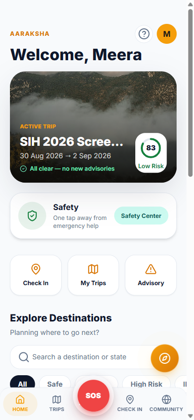 | 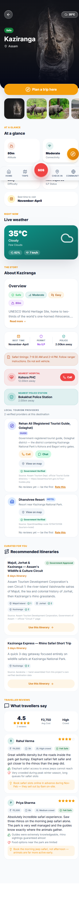 |
| *Home: active trip, TSI badge, quick actions* | *Destination: reviews, operators, advisories* |

| AI Planner — Natural Language | AI Planner — Plan Preview |
|-------------------------------|--------------------------|
| 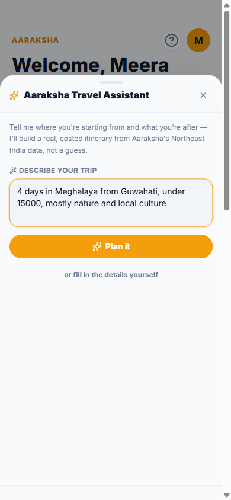 | 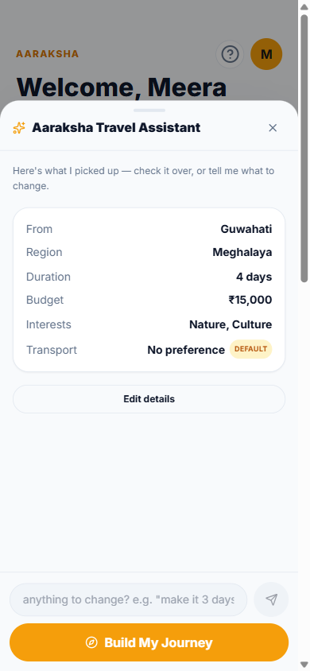 |
| *Natural language goals input* | *Review AI-extracted intent before generation* |

| Built Itinerary | Safety Hub |
|----------------|------------|
| 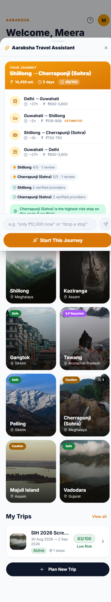 | 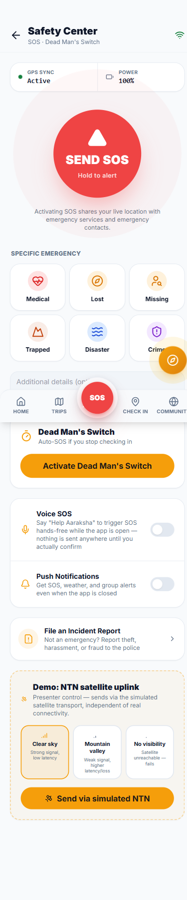 |
| *Scored plan with per-stop TSI* | *SOS · DMS · check-in · advisories* |

### Guardian Portal — Family Visibility

| PIN Gate | Live Tracking |
|----------|--------------|
| 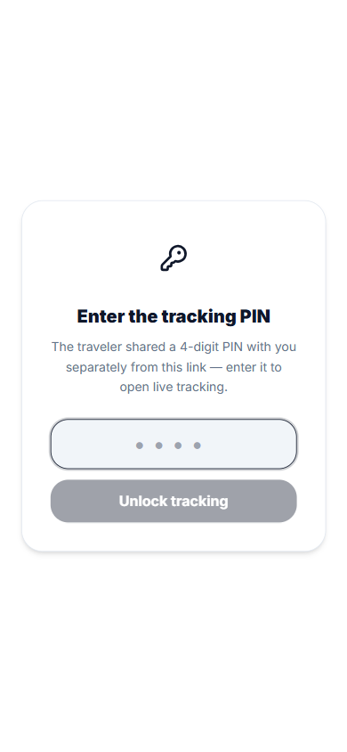 | 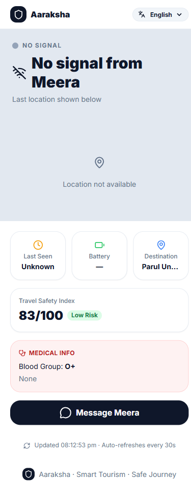 |
| *4-digit PIN (set by tourist)* | *Live map · timeline · battery % · DMS status* |

### Government Command Center — Operations

| Command Dashboard | Live Ops Map |
|-------------------|--------------|
| 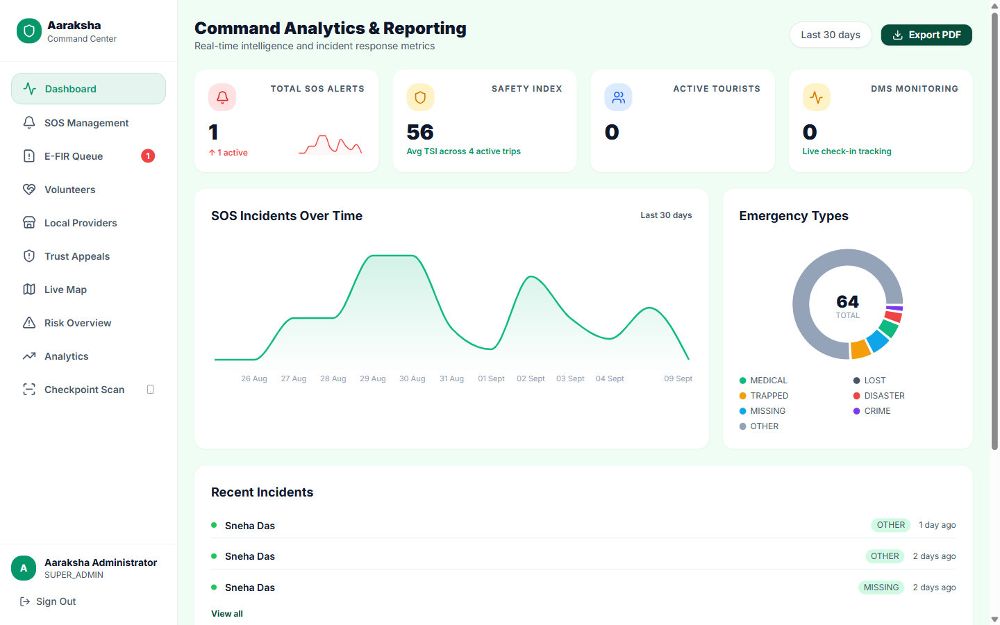 | 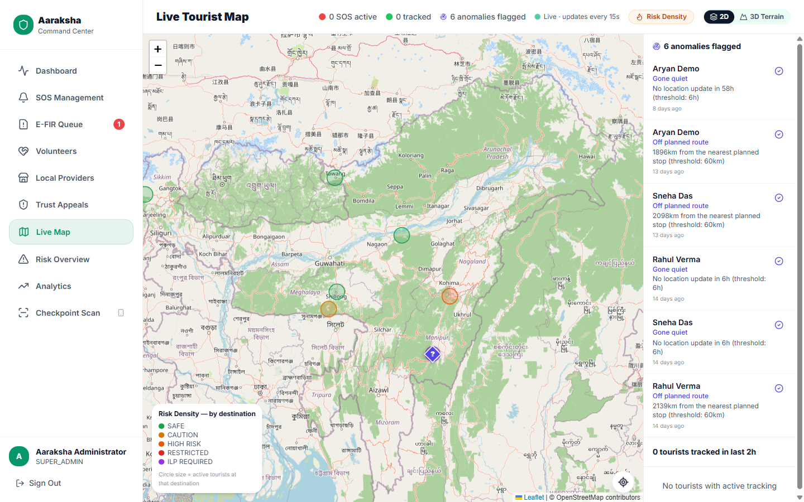 |
| *Live stats · recent SOS · risk overview* | *Real-time SOS map with team positions* |

| SOS Triage & Rescue | Local Operator Verification |
|--------------------|----------------------------|
| 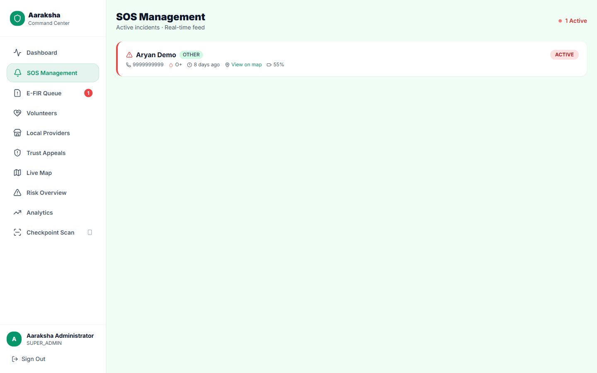 | 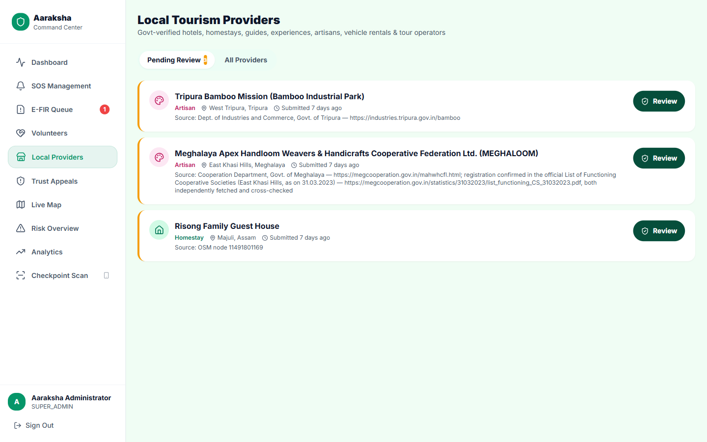 |
| *Assign team + volunteer, chat with tourist* | *Gate before tourist-facing visibility* |

### Responder App — Dispatch & Navigation

| Home · Dispatch Ready | Active Job |
|-----------------------|-----------|
| 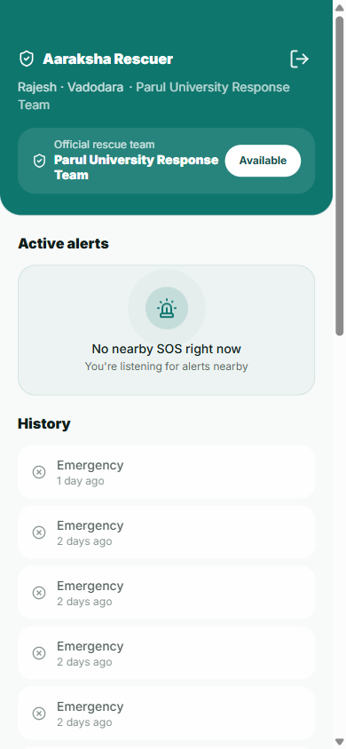 | 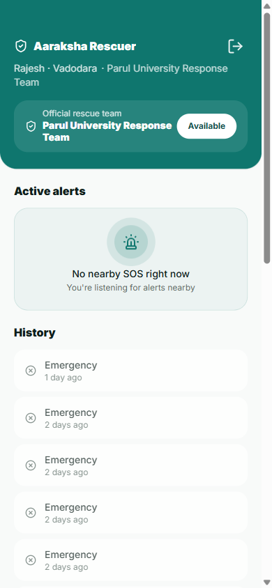 |
| *Govt-verified status toggle · dispatch alerts* | *MapLibre route to SOS site · tourist chat* |

---

## Proof of Work

> Every claim below is backed by code in the private repository, screenshots above, or QA documentation in `docs/testing/`.

| Capability | Evidence |
|-----------|---------|
| **4 deployed portals** | Live Vercel URLs · 21 real screenshots in `screenshots/` |
| **152 API endpoints** | Evaluated across 20 route files |
| **34 database tables** | Tracked across 36 node-pg-migrate migrations |
| **74 vitest tests** | Logic and integration tests in `backend/tests/` |
| **336 Postman assertions** | Documented via Newman API contract runs |
| **13 QA phases** | `docs/testing/` — 12 adversarial phases + final acceptance |
| **8 security defects fixed** | `docs/testing/09-security-audit.md` |
| **CI/CD pipeline** | `.github/workflows/test.yml` — backend vitest + frontend tsc matrix |
| **Real-time (Socket.IO)** | Live SOS → map latency measured in QA |
| **Offline SOS** | Twilio inbound webhook integration tested |
| **Verified local operators** | `local_operators` table · govt verification UI · seed data |
| **TSI algorithm** | 100% JS logic tested via `tsi.service.test.js` |
| **JWT security** | Algorithm pinned to HS256 |
| **SQL injection held** | Parameterized queries only (`$1, $2`). No string interpolation. |
| **DPDP Act compliance** | Data export · anonymize-in-place erasure flow implemented |

---

## Testing & Security

### Test Coverage

| Layer | Count | Notes |
|-------|-------|-------|
| Backend (vitest) | **74 tests** | TSI scoring · itinerary scoring · crypto · auth |
| Frontend | **~95 tests** | Across all 4 portals |
| Postman | **336 assertions** | `backend/postman/aaraksha-collection.json` (151 requests) |

### 13-Phase QA Process

**Zero P0 or P1 issues open at final acceptance.**
See all reports in: [`docs/testing/`](./docs/testing/)

| Phase | Focus | Outcome |
|-------|-------|---------|
| 1–11 | System · API · portals · offline · security · real-time | PASS WITH ISSUES (defects fixed) |
| 12 | Regression | **PASS** |
| 13 | Final acceptance | **PASS ✅** |

---

## Live Deployment

| Portal | URL |
|--------|-----|
| Tourist PWA | https://aaraksha-tourist.vercel.app |
| Government Command Center | https://aaraksha-govt.vercel.app |
| Guardian Portal | https://aaraksha-guardian.vercel.app |
| Responder App | https://aaraksha-rescuer.vercel.app |
| Backend API | Render (Singapore) — ping `/health` to warm before demo |

> **Render free-tier cold start:** After idle, expect 20–30s for the first response.

Full demo walkthrough: [`docs/deployment/demo-guide.md`](./docs/deployment/demo-guide.md)

---

## Project Structure

```
aaraksha/                               ← Private production repo
├── backend/
│   ├── src/
│   │   ├── app.js                      ← Express + middleware stack
│   │   ├── routes/          (20 files) ← URL pattern + middleware mount
│   │   ├── controllers/     (19 files) ← Input validation, service calls
│   │   ├── services/        (38 files) ← Business logic and orchestration
│   │   ├── repositories/    (19 files) ← Parameterized SQL query layer
│   │   ├── socket/                     ← Rooms and event emitters
│   │   ├── cron/                       ← DMS (60s) · weather (60min)
│   │   └── migrations/      (36 files) ← node-pg-migrate schema history
│   ├── scripts/                        ← seed · preflight · curate
│   ├── tests/               (7 files)  ← Vitest suite
│   └── postman/                        ← 336 assertions · 151 requests
│
├── frontend/
│   ├── tourist/                        ← PWA · amber · mobile-first
│   ├── govt/                           ← Desktop · emerald · RBAC
│   ├── guardian/                       ← Public · PIN-gated
│   └── volunteer/                      ← Mobile · teal · dispatch UX
│
└── docs/                               ← Architecture · DB · API guides
```

---

## Prototype Boundaries

Aaraksha is a hackathon prototype for SIH 2026. Honest documented limits:

| Boundary | Detail |
|----------|--------|
| Rate limiting in-memory | Resets on restart; `rate-limit-redis` is the production upgrade |
| Render free tier | Cold starts after idle — infra choice, not an app bug |
| Seeded operator data | Covers TOUR_OPERATOR + VEHICLE_RENTAL. HOTEL/HOMESTAY/GUIDE/ARTISAN are schema-ready but not seeded |
| E-FIR photo serving | Files served without auth check; UUID filenames are unguessable |
| Guardian token renewal | No auto-renewal on expiry — documented gap |
| Not integrated with NDMA | No live connection to government emergency systems |
| Not a booking platform | Provides discovery/contact pathways; no in-app payment |

---

## Future Work

| Priority | Feature |
|----------|---------|
| P1 | Redis-backed rate limiting · E-FIR photo auth · guardian token renewal |
| P2 | Full HOTEL / HOMESTAY / GUIDE / ARTISAN operator seeding |
| Medium | Offline MBTiles maps for key NER districts |
| Long-term | Real NTN satellite integration · Regional language expansion |

---

## Deep Documentation

| Document | Description |
|----------|-------------|
| [`docs/CANONICAL_FACTS.md`](./docs/CANONICAL_FACTS.md) | Verified numbers, corrected claims |
| [`docs/project-overview.md`](./docs/project-overview.md) | Problem, PS 26204, three pillars |
| [`docs/architecture/architecture.md`](./docs/architecture/architecture.md) | Layer structure, security, algorithms |
| [`docs/architecture/database-schema.md`](./docs/architecture/database-schema.md) | 34 tables, 36 migrations, key decisions |
| [`docs/architecture/ai-intelligence.md`](./docs/architecture/ai-intelligence.md) | AI vs deterministic boundary |
| [`docs/portals/portals.md`](./docs/portals/portals.md) | All four portals deep-dive |
| [`docs/portals/tourism-ecosystem.md`](./docs/portals/tourism-ecosystem.md) | Operator pipeline, curated routes |
| [`docs/safety/safety-resilience.md`](./docs/safety/safety-resilience.md) | SOS lifecycle, DMS, offline SMS, DPDP |
| [`docs/api/api-reference.md`](./docs/api/api-reference.md) | 152 endpoints across 19 route groups |
| [`docs/testing/testing-summary.md`](./docs/testing/testing-summary.md) | Coverage, QA, security evidence |
| [`docs/testing/FINAL_QA_REPORT.md`](./docs/testing/FINAL_QA_REPORT.md) | Final acceptance: PASS |
| [`docs/deployment/demo-guide.md`](./docs/deployment/demo-guide.md) | Demo flow, live URLs, CI/CD |

---

<div align="center">

**Built for SIH 2026 · PS 26204 · Travel & Tourism · Team Latent**

*Northeast India deserves a tourism ecosystem as remarkable as its landscapes.*

**[→ Request Controlled Codebase Access](https://github.com/aryanf192811-eng/Aaraksha)**

</div>
